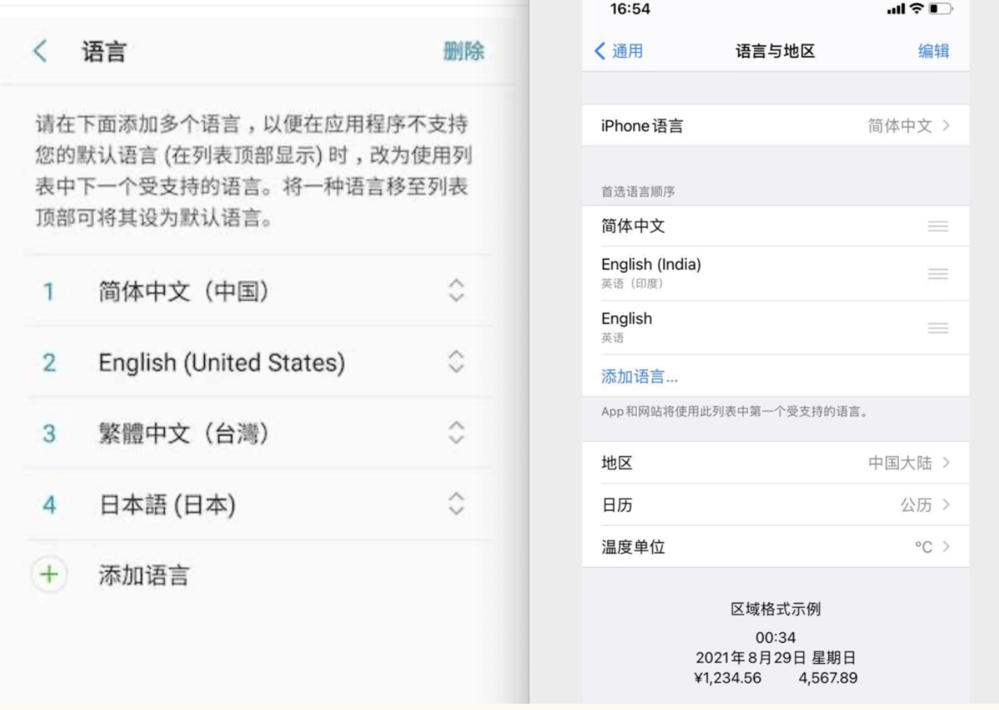

###Flutter 国际化

[详情链接](https://book.flutterchina.club/chapter13/multi_languages_support.html)

###1：让App支持多语言

需要我们在开发时需要为应用程序支持的每种语言环境设置“本地化”的一些值，如文本和布局。
Flutter SDK已经提供了一些组件和类来帮助我们实现国际化。这里主要是指 文案（字符串）

####支持国际化

1：我们以`MaterialApp`为入口，大多数应用都是通过`MaterialApp`为入口。

2：Flutter SDK 默认支持美国英语本地化资源（主要是文本），其他语言需要添加包依赖 `flutter_localizations`。

3：指定`MaterialApp`的 `localizationsDelegates`和 `supportedLocales`。

```
dependencies:
  flutter:
    sdk: flutter
  flutter_localizations:
    sdk: flutter
```
```
import 'package:flutter_localizations/flutter_localizations.dart';
new MaterialApp(
 localizationsDelegates: [
   // 本地化的代理类
   GlobalMaterialLocalizations.delegate, //PS: 基于WidgetsApp类为入口的应用程序进行国际化时, 不需要这个
   GlobalWidgetsLocalizations.delegate,// 定义组件默认的文本方向，从左到右或从右到左.
   GlobalCupertinoLocalizations.delegate,
 ],
 supportedLocales: [ // 当前应用支持的locale列表
    const Locale('en', 'US'), // 美国英语
    const Locale('zh', 'CN'), // 中文简体
    //其它Locales
  ],
  // ...
)
```

#### 获取当前区域Locale。 
PS: 不太好用。
```
Locale locale = Localizations.localeOf(context);
```
####手动指定local

```
 Widget widget1 = MaterialApp(
      locale: const Locale('en', 'US'),//手动指定locale
    );
```

####监听系统语言切换

当我们更改系统语言设置时，APP中的Localizations组件会重新构建，Localizations.localeOf(context) 获取的Locale就会更新，最终界面会重新build达到切换语言的效果，但是这个过程是隐式完成的。

我们可以通过localeResolutionCallback或localeListResolutionCallback回调来监听locale改变的事件。
```
Widget widget1 = MaterialApp(
      // typedef LocaleResolutionCallback = Locale? Function(Locale? locale, Iterable<Locale> supportedLocales);
      localeResolutionCallback: (Locale? locale, Iterable<Locale> supportedLocales){
        //local: 当前的当前的系统语言设置
        //supportedLocales: 为当前应用支持的locale列表，是开发者在MaterialApp中通过supportedLocales属性注册的
        // return Locale?
      },
      // typedef LocaleListResolutionCallback = Locale? Function(List<Locale>? locales, Iterable<Locale> supportedLocales);
      localeListResolutionCallback: (List<Locale>? locales, Iterable<Locale> supportedLocales){
        //local: 当前的当前的locales 列表
        //supportedLocales: 为当前应用支持的locale列表，是开发者在MaterialApp中通过supportedLocales属性注册的
        // return Locale?
    },
   );
}
```


####Localization组件
Localizations组件用于加载和查找应用当前语言下的本地化值或资源。应用程序通过[`Localizations.of(context,type)` (opens new window)](https://docs.flutter.io/flutter/widgets/Localizations/of.html)来引用这些对象。 如果设备的Locale区域设置发生更改，则Localizations 组件会自动加载新区域的Locale值，然后重新build使用（依赖）了它们的组件，之所以会这样，是因为`Localizations`内部使用了[InheritedWidget (opens new window)](https://book.flutterchina.club/chapter7/inherited_widget.html)，该组件：当子组件的`build`函数引用了`InheritedWidget`时，会创建对`InheritedWidget`的隐式依赖关系。因此，当`InheritedWidget`发生更改时，即`Localizations`的Locale设置发生更改时，将重建所有依赖它的子组件。

####使用系统打包好的`LocalizationDelegates`

为了尽可能小而且简单，flutter软件包中仅提供美国英语值的`MaterialLocalizations`和`WidgetsLocalizations`接口的实现。

ps: `GlobalCupertinoLocalizations`也提供了。

如果我们要让自己的布局支持多语言，那么就需要实现自己的`Localizations`。

主要源码：

```
abstract class LocalizationsDelegate<T> {

  const LocalizationsDelegate();

  bool isSupported(Locale locale);

  Future<T> load(Locale locale);

  bool shouldReload(covariant LocalizationsDelegate<T> old);

  Type get type => T;

  @override
  String toString() => '${objectRuntimeType(this, 'LocalizationsDelegate')}[$type]';
}

```

###2：实现自定义Localizations

  >`static const LocalizationsDelegate<MaterialLocalizations> delegate = _MaterialLocalizationsDelegate();`

[自定义实现Localizations](https://book.flutterchina.club/chapter13/locallization_implement.html)

我们需要实现两个类：一个Delegate类一个Localizations类。

**实现Localizations类**
```
//Locale资源类
class DemoLocalizations {
  DemoLocalizations(this.isZh);
  //是否为中文
  bool isZh = false;
  //为了使用方便，我们定义一个静态方法
  static DemoLocalizations of(BuildContext context) {
    return Localizations.of<DemoLocalizations>(context, DemoLocalizations);
  }
  //Locale相关值，title为应用标题
  String get title {
    return isZh ? "Flutter应用" : "Flutter APP";
  }
  //... 其它的值  
}
```
**实现Delegate类**

Delegate类的职责是在Locale改变时加载新的Locale资源，所以它有一个load方法，Delegate类需要继承自LocalizationsDelegate类，实现相应的接口
```
//Locale代理类
class DemoLocalizationsDelegate extends LocalizationsDelegate<DemoLocalizations> {
  const DemoLocalizationsDelegate();

  //是否支持某个Local
  @override
  bool isSupported(Locale locale) => ['en', 'zh'].contains(locale.languageCode);

  // Flutter会调用此类加载相应的Locale资源类
  @override
  Future<DemoLocalizations> load(Locale locale) {
    print("$locale");
    return SynchronousFuture<DemoLocalizations>(
        DemoLocalizations(locale.languageCode == "zh")
    );
  }

  @override
  bool shouldReload(DemoLocalizationsDelegate old) => false;
}
```
**添加多语言支持**

先注册DemoLocalizationsDelegate类，然后再通过DemoLocalizations.of(context)来动态获取当前Locale文本。

```
localizationsDelegates: [
 // 本地化的代理类
 GlobalMaterialLocalizations.delegate,
 GlobalWidgetsLocalizations.delegate,
 // 注册我们的Delegate
 DemoLocalizationsDelegate()
],
```
**食用:**
```
return Scaffold(
  appBar: AppBar(
    //使用Locale title  
    title: Text(DemoLocalizations.of(context).title),
  ),
  ... //省略无关代码
 ） 
```

###3：捷径— 使用Intl包

```
dependencies:
  #...省略无关项
  intl: ^0.15.7 
dev_dependencies:
   #...省略无关项
  intl_translation: ^0.17.2  
```

[intl_translation (opens new window)](https://pub.dartlang.org/packages/intl_translation)包主要包含了一些工具，它在开发阶段主要的作用是从代码中提取要国际化的字符串到单独的arb文件和根据arb文件生成对应语言的dart代码。

`intl`包主要是引用和加载`intl_translation`生成后的dart代码。

[食用详情](https://book.flutterchina.club/chapter13/intl.html)  简单步骤：
* 创建必要目录，包含arb文件
* 实现Localizations和Delegate类，使用Intl包中方法。
* 添加需要国际化的属性
* 生成arb文件，通过命令
* 生成Dart代码，通过命令
* 合成命令脚本

###4：超捷径 插件Intl 

[Flutter Intl 插件食用](https://www.jianshu.com/p/dd7862e8ae66)
简洁好用。

附赠：[language code list](http://www.lingoes.cn/zh/translator/langcode.htm)

[country code list](https://www.cnblogs.com/exmyth/p/8428459.html)

###5：国际化一般会碰到的问题

1：[应用标题国际化](https://book.flutterchina.club/chapter13/faq.html)
2：为英语系国家指定同一个locale


