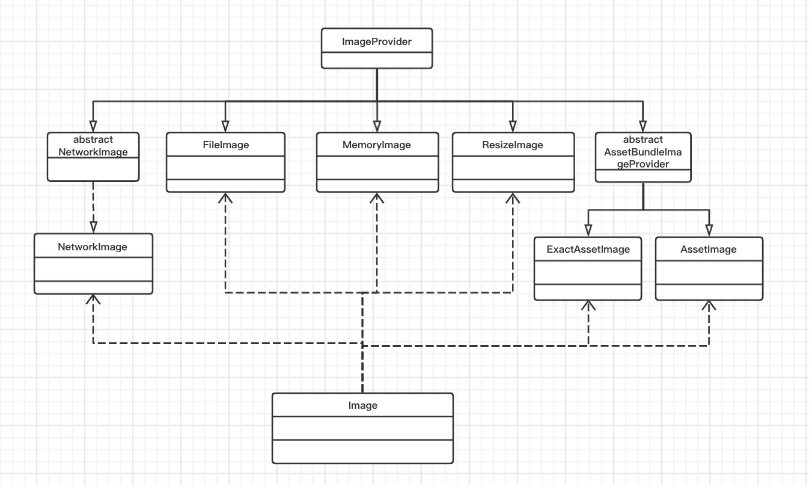
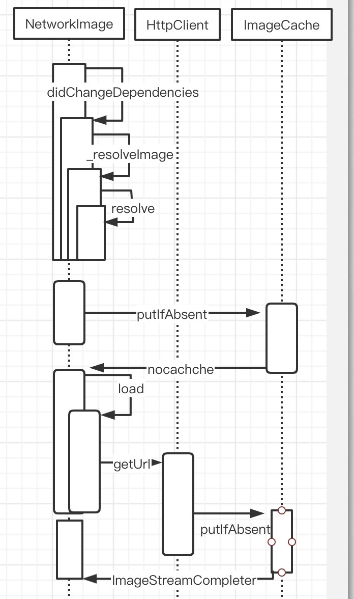

#Image的基本使用
Image是显示图片的一个Widget。image支持的图片格式为：JPEG, PNG, GIF, Animated GIF, WebP, Animated WebP, BMP, and WBMP。
image的基本使用方法:

|构造方法|描述|
|----|----|
|Image()|从ImageProvider中获取图片，从本质上看，下面的几个方法都是他的具体实现。|
|Image.asset(String name)|从AssetBundler中获取图片|
|Image.network(String url)|显示网络图片，参数为url|
|Image.file(File file)|从File中获取图片|
|Image.memory(Uint8List bytes)|从Uint8List中显示图片|
具体使用：
## image.asset加载资源图片
Flutter可以为当前设备加载适合其分辨率的图像。
首先要在根目录assets下,新建image文件夹，由于Flutter加载图片时需要2倍图、3倍图，默认图。所以需要同时新建2.0x和3.0x文件夹。


然后，在pubspec.yaml配置文件中，yaml是类似于xml的一种标记性语言，其中“-”表示数组。在这里，我们也可以使用下面的写法，加载整个资源文件图片：


使用资源图片文件(填入图片的全路径即可)：
Image.asset("assets/images/flutter.jpeg")
## Image.network加载网络图片
```dart
Image.network(
            'https://image1.guazistatic.com/qn210519171455ac369db6cfecbf11d017210f2986a031.jpg')
```
## Image.file加载图片文件
Image.file(File("/sdcard/flutter.jpeg"))
注意在AndroidManifest.xml中配置读写文件权限
## Image.memory加载缓存文件
Image.memory(bytes);
## fit属性的设置
fit属性可以控制图片的拉伸和挤压，这些都是根据图片的父级容器来的.

BoxFit.fill:全图显示，图片会被拉伸，并充满父容器。

BoxFit.contain:全图显示，显示原比例，可能会有空隙。

BoxFit.cover：显示可能拉伸，可能裁切，充满（图片要充满整个容器，还不变形）。

BoxFit.fitWidth：宽度充满（横向充满），显示可能拉伸，可能裁切。

BoxFit.fitHeight ：高度充满（竖向充满）,显示可能拉伸，可能裁切。

BoxFit.scaleDown：效果和contain差不多，但是此属性不允许显示超过源图片大小，可小不可大。
## repeat图片重复
ImageRepeat.repeat : 横向和纵向都进行重复，直到铺满整个画布。

ImageRepeat.repeatX: 横向重复，纵向不重复。

ImageRepeat.repeatY：纵向重复，横向不重复。

ImageRepeat.noRepeat:不重复。
## alignment图片对齐
Alignment.center:居中

Alignment.centerLeft:居左

Alignment.centerRight:居右

Alignment.topCenter:顶部居中

Alignment.topLeft:顶部居左

Alignment.topRight:顶部居右

Alignment.bottomCenter:底部居中

Alignment.bottomLeft:底部居左

Alignment.bottomRight:底部居右
## colorBlendMode图片颜色及混合模式


color为源图像，image为目标图像
BlendMode.clear:不显示源图像和目标图像。

BlendMode.src:仅显示源图像。

BlendMode.dst:仅绘制目标图像。

BlendMode.srcOver:源图显示到目标图像上，源图像在上面,透明区域显示目标图层。

BlendMode.dstOver:目标图像显示在源图像上，目标图像在上面。

BlendMode.srcIn: 显示源图像且仅显示两个图像重叠位置。目标图像不绘制，只有不透明度起作用。

BlendMode.dstIn:显示目标图像且仅显示两个图像重叠部分，源图像不绘制只有不透明度起作用。

BlendMode.srcOut:显示源图像且仅显示两个图像不重叠位置。目标图像不绘制，只有不透明度起作用。

BlendMode.dstOut:显示目标图像且仅显示两个图像不重叠部分，源图像不绘制只有不透明度起作用。

BlendMode.srcATop:将源图像合成到目标图像上，但仅在与目标图像重叠的位置合成。但是输出的不透明度通道设置为目标图像的不透明度通道，而不是两个图像的不透明度通道的组合。

BlendMode.dstATop:将目标图像合成到源图像上，但仅在与源图像重叠的位置合成。但是将输出的不透明度通道设置为源图像的不透明度通道，而不是将两个图像的不透明度通道组合在一起。

BlendMode.xor:对源图像和目标图像应用按位“ xor”运算符。这将使它们重叠的地方保持透明。

BlendMode.plus:对源图像和目标图像的组成部分求和。

BlendMode.modulate:将源图像和目标图像的颜色分量相乘。这只能产生相同或较深的颜色（乘以白色1.0，结果不变；乘以黑色0.0，结果黑色）。合成两个不透明图像时，这与在投影机上重叠两个透明胶片具有相似的效果。

BlendMode.screen:将源图像和目标图像的分量的逆值相乘，然后将结果相逆。反转分量意味着将完全饱和的通道（不透明的白色）视为值0.0，将通常视为0.0的值（黑色，透明）视为1.0。这本质上与[调制]混合模式相同，但是颜色的值在乘法之前先反转，结果在渲染前先反转。这只能导致颜色相同或更浅（乘以黑色1.0不会导致更改；乘以白色0.0则会导致白色）。同样，在Alpha通道中，它只能导致更不透明的颜色。这与两台投影机在同一屏幕上同时显示其图像的效果相似。

BlendMode.overlay:在将源图像和目标图像的分量调整为适合目标后，将它们相乘。具体而言，如果目标值较小，则将其与源值相乘，而当源值较小时，则将源值的逆与目标值的逆相乘，然后求反。反转分量意味着将完全饱和的通道（不透明的白色）视为值0.0，将通常视为0.0的值（黑色，透明）视为1.0。

BlendMode.darken:通过从每个颜色通道中选择最小值来合成源图像和目标图像,透明区域显示目标图层。

BlendMode.lighten:通过从每个颜色通道中选择最大值来合成源图像和目标图像,透明区域显示目标图层。

BlendMode.colorDodge:将目标除以源的倒数。反转分量意味着将完全饱和的通道（不透明的白色）视为值0.0，将通常视为0.0的值（黑色，透明）视为1.0。

BlendMode.colorBurn:将目标的倒数除以源，然后将结果倒数。反转分量意味着将完全饱和的通道（不透明的白色）视为值0.0，将通常视为0.0的值（黑色，透明）视为1.0。

BlednMode.hardLight:调整源图像和目标图像的分量以使其适合源图像后，将它们相乘。具体来说，如果源值较小，则将其与目标值相乘，而当目标值较小时，则将目标值的逆与源值的逆相乘，然后求反。反转分量意味着将完全饱和的通道（不透明的白色）视为值0.0，将通常视为0.0的值（黑色，透明）视为1.0

BlendMode.softLight: 对于低于0.5的源值使用[colorDodge]，对于高于0.5的源值使用[colorBurn]。与[overlay]相比，这会产生相似但较柔和的效果

BlendMode.difference: 从每个通道的较大值中减去较小的值。合成黑色没有效果。合成白色会使另一张图像的颜色反转。输出图像的不透明度的计算方法与[srcOver]相同。

BlendMode.exclusion: 从两个图像的总和中减去两个图像的乘积的两倍。合成黑色没有效果。合成白色会使另一张图像的颜色反转。输出图像的不透明度的计算方法与[srcOver]相同。效果类似于[difference]，但较柔和。

BlendMode.multiply: 将源图像和目标图像的分量相乘，包括alpha通道。这只能产生相同或较深的颜色（乘以白色1.0，结果不变；乘以黑色0.0，结果黑色）。由于alpha通道也被相乘，因此一幅图像中的全透明像素（不透明度0.0）导致输出中的全透明像素。这类似于[dstIn]，但将颜色组合在一起。对于多种颜色但不乘以Alpha通道的变体，请考虑[modulate]。

BlendMode.hue: 获取源图像的​​色相，以及目标图像的饱和度和光度。效果是用源图像对目标图像进行着色。输出图像的不透明度的计算方法与[srcOver]相同。源图像中完全透明的区域会从目标获得其相色。

BlendMode.saturation: 获取源图像的​​饱和度以及目标图像的色相和亮度。输出图像的不透明度的计算方法与[srcOver]相同。源图像中完全透明的区域从目标位置开始饱和。

BlendMode.color: 获取源图像的​​色相和饱和度以及目标图像的光度。效果是用源图像对目标图像进行着色。输出图像的不透明度的计算方法与[srcOver]相同。源图像中完全透明的区域从目标位置获得其色相和饱和度。

BlendMode.luminosity: 获取源图像的​​亮度，以及目标图像的色相和饱和度。输出图像的不透明度的计算方法与[srcOver]相同。源图像中完全透明的区域从目的地获取其亮度。

## centerSlice图片局部放大：


原图：


效果图：


# Image的源码

具体图片加载时序图

下面通过Image.network的源码来看下图片是如何下载以及如何缓存的
```
Image.network(
    String src, {
    ...}) : image = ResizeImage.resizeIfNeeded(cacheWidth, cacheHeight, NetworkImage(src, scale: scale, headers: headers)),
```
NetworkImage他的实现类如下：
```
@immutable
class NetworkImage extends image_provider.ImageProvider<image_provider.NetworkImage> implements image_provider.NetworkImage
```
可以看到网络加载的图片和AssetImage等都是image_provide的实现类，
它的主要职责有两个：
提供图片数据源
缓存图片
主要基类：
## resolve方法

```
@nonVirtual
  ImageStream resolve(ImageConfiguration configuration)
```

 使用给定的“ configuration”解析此图像，并返回[ImageStream]。这是[ImageProvider]类层次结构的公共入口点。子类应实现此方法使用的[obtainKey]和[load]。如果他们需要更改使用的[ImageStream]的实现，则应重写[createStream]。如果他们需要管理图像的实际分辨率，则应重写[resolveStreamForKey]。
 
 ImageConfiguration 包含图片和设备的相关信息，如图片的大小、所在的AssetBundle(只有打到安装包的图片存在)以及当前的设备平台、devicePixelRatio（设备像素比等）。Flutter SDK提供了一个便捷函数createLocalImageConfiguration来创建ImageConfiguration 对象：
 
```
@immutable
class ImageConfiguration {
  
  const ImageConfiguration({
    this.bundle,
    this.devicePixelRatio,
    this.locale,
    this.textDirection,
    this.size,
    this.platform,
  });
```

 ##具体看下resolve方法
 
 ```
 ImageStream resolve(ImageConfiguration configuration) {
 ...
 _createErrorHandlerAndKey(
      configuration,
      (T key, ImageErrorListener errorHandler) {
        resolveStreamForKey(configuration, stream, key, errorHandler);
      },
 }
 ```
 
 对应resolveStreamForKey方法实现：
 
```
@protected
  void resolveStreamForKey(ImageConfiguration configuration, ImageStream stream, T key, ImageErrorListener handleError) {
    if (stream.completer != null) {
      final ImageStreamCompleter? completer = PaintingBinding.instance!.imageCache!.putIfAbsent(
        key,
        () => stream.completer!,
        onError: handleError,
      );
      assert(identical(completer, stream.completer));
      return;
    }
    final ImageStreamCompleter? completer = PaintingBinding.instance!.imageCache!.putIfAbsent(
      key,
      () => load(key, PaintingBinding.instance!.instantiateImageCodec),
      onError: handleError,
    );
    if (completer != null) {
      stream.setCompleter(completer);
    }
  }
```
  
有缓存则使用缓存，没有缓存则调用load方法加载图片，加载成功后:

先判断图片数据有没有缓存，如果有，则直接返回ImageStream。
如果没有缓存，则调用load(T key)方法从数据源加载图片数据，加载成功后先缓存，然后返回ImageStream。

这里的PaintingBinding.instance.imageCache 是 ImageCache的一个实例，它是PaintingBinding的一个属性，而Flutter框架中的PaintingBinding.instance是一个单例，imageCache事实上也是一个单例，也就是说图片缓存是全局的，统一由PaintingBinding.instance.imageCache 来管理。

来看一下ImageCache

```
const int _kDefaultSize = 1000;
const int _kDefaultSizeBytes = 100 << 20; // 100 MiB
class ImageCache {
  final Map<Object, _PendingImage> _pendingImages = <Object, _PendingImage>{};//正在加载中的图片队列
  final Map<Object, _CachedImage> _cache = <Object, _CachedImage>{};//缓存队列
  final Map<Object, _LiveImage> _liveImages = <Object, _LiveImage>{};//活动的图片队列
  int get maximumSize => _maximumSize;
  int _maximumSize = _kDefaultSize;

```

可以看到：
_pendingImages正在加载中的图片队列
_cache缓存队列
缓存图片上线1000张，最大缓存100M

```
ImageStreamCompleter? putIfAbsent(Object key, ImageStreamCompleter loader(), { ImageErrorListener? onError }) {
    ImageStreamCompleter? result = _pendingImages[key]?.completer;
    // 如果正在加载队列不为空，还没有加载完成，直接返回
    if (result != null) {
      return result;
    }
    // 先删除旧的引用，以便后面重新加到最近使用的位置
    final _CachedImage? image = _cache.remove(key);
    if (image != null) {
      _cache[key] = image;
      return image.completer;
    }
    //如果活动图片不为空，返回活动图片
    final _LiveImage? liveImage = _liveImages[key];
    if (liveImage != null) {
        return liveImage.completer;
    }
    //以上都没有则调用load加载
    try {
      result = loader();
    } catch (error, stackTrace) {
      if(onError != null) {
        onError(error, stackTrace);
        return null;
      } else {
        rethrow;
      }
    }
    // 这里设置监听器为false
    bool listenedOnce = false;
    // 如果图片缓存不可用，也不应该使用正在加载的图片队列，那么我们至少要有一个监听器监听图片，否则活动图片会有内存泄漏风险 
    _PendingImage? untrackedPendingImage;
    void listener(ImageInfo? info, bool syncCall) {
      int? sizeBytes;
      if (info != null) {
        sizeBytes = info.image.height * info.image.width * 4;
        info.dispose();
      }
      final _CachedImage image = _CachedImage(
        result!,
        sizeBytes: sizeBytes,
      );
    //追踪活动图片
      _trackLiveImage(key, result, sizeBytes);
      // 如果初次调用resolve时缓存了那么只追踪图片
      if (untrackedPendingImage == null) {
        _touch(key, image, listenerTask);
      } else {
        image.dispose();
      }
      //如果没有加载完成则移除监听
      final _PendingImage? pendingImage = untrackedPendingImage ?? _pendingImages.remove(key);
      if (pendingImage != null) {
        pendingImage.removeListener();
      }
      //监听状态置为true
      listenedOnce = true;
    }
    //给图片添加监听
    final ImageStreamListener streamListener = ImageStreamListener(listener);
    if (maximumSize > 0 && maximumSizeBytes > 0) {
      _pendingImages[key] = _PendingImage(result, streamListener);
    } else {
      untrackedPendingImage = _PendingImage(result, streamListener);
    }
    // 添加监听器
    result.addListener(streamListener);
    return result;
  }
```

可以看到，这里检测缓存图片是否存在，存在则直接返回，不存在则删掉缓存中对应的key，然后缓存图片。

//下面检测缓存方法
```
 void _checkCacheSize(TimelineTask? timelineTask) {
    final Map<String, dynamic> finishArgs = <String, dynamic>{};
    TimelineTask? checkCacheTask;
    while (_currentSizeBytes > _maximumSizeBytes || _cache.length > _maximumSize) {
      final Object key = _cache.keys.first;
      final _CachedImage image = _cache[key]!;
      _currentSizeBytes -= image.sizeBytes!;
      image.dispose();
      _cache.remove(key);
    }
  }
```

当缓存数量超过最大值或缓存大小超过最大缓存容量，则会清理到缓存上限以内。
 ## obtainKey方法
Future<T> obtainKey(ImageConfiguration configuration);
该接口主要是为了配合实现图片缓存，ImageProvider从数据源加载完数据后，会在全局的ImageCache中缓存图片数据，而图片数据缓存是一个Map，而Map的key便是调用此方法的返回值，不同的key代表不同的图片数据缓存。对应实现：
```
@override
  Future<NetworkImage> obtainKey(image_provider.ImageConfiguration configuration) {
    return SynchronousFuture<NetworkImage>(this);
  }
```

因为Map中在判断key（此时是NetworkImage对象）是否相等时会使用"="运算符，那么定义key的逻辑就是NetworkImage的“==”运算符：
```
 @override
  bool operator ==(Object other) {
    if (other.runtimeType != runtimeType)
      return false;
    return other is NetworkImage
        && other.url == url
        && other.scale == scale;
  }
```

  这里可以看出key是由url+scale决定的，同一个url不同scale会重复下载。

## load方法

```
 @protected
  ImageStreamCompleter load(T key, DecoderCallback decode);
```
将密钥转换为[ImageStreamCompleter]，然后开始获取图像。 [decode]回调提供了获取图像编解码器的逻辑。
load方法的返回值类型是ImageStreamCompleter ，它是一个抽象类，定义了管理图片加载过程的一些接口，Image Widget中正是通过它来监听图片加载状态的。

MultiFrameImageStreamCompleter 是 ImageStreamCompleter的一个子类，是flutter sdk预置的类，通过该类，我们可以方便、轻松地创建出一个ImageStreamCompleter实例来做为load方法的返回值。

具体子类NetworkImage实现load

```
 @override
  ImageStreamCompleter load(image_provider.NetworkImage key, image_provider.DecoderCallback decode) {
    // Ownership of this controller is handed off to [_loadAsync]; it is that
    // method's responsibility to close the controller's stream when the image
    // has been loaded or an error is thrown.
    final StreamController<ImageChunkEvent> chunkEvents = StreamController<ImageChunkEvent>();

    return MultiFrameImageStreamCompleter(
      codec: _loadAsync(key as NetworkImage, chunkEvents, decode),
```
具体_loadAsync实现

```
 Future<ui.Codec> _loadAsync(
    NetworkImage key,
    StreamController<ImageChunkEvent> chunkEvents,
    image_provider.DecoderCallback decode,
  ) async {
    try {
    //解析url
      final Uri resolved = Uri.base.resolve(key.url);
    //请求网络
      final HttpClientRequest request = await _httpClient.getUrl(resolved);

      headers?.forEach((String name, String value) {
        request.headers.add(name, value);
      });
      final HttpClientResponse response = await request.close();
     //将HttpClientResponse的响应主体转换为Uint8List 。返回的Future将转发response发出的任何错误。
      final Uint8List bytes = await consolidateHttpClientResponseBytes(
        response,
        onBytesReceived: (int cumulative, int? total) {
          chunkEvents.add(ImageChunkEvent(
            cumulativeBytesLoaded: cumulative,
            expectedTotalBytes: total,
          ));
        },
      );
      return decode(bytes);
    } catch (e) {
     //添加微任务，移除对应缓存
      scheduleMicrotask(() {
        PaintingBinding.instance!.imageCache!.evict(key);
      });
      rethrow;
    } finally {
      chunkEvents.close();
    }
  }
```

可以看到_loadAsync方法主要做了两件事：
1.下载图片。
2.对下载的图片数据进行解码。
这里获取图片，解码图片。具体解码图片是底层做的。

```
@pragma('vm:entry-point')
class Codec extends NativeFieldWrapperClass2 {
  //此类是由引擎创建的，不应直接实例化或扩展。要获取[Codec]接口的实例，请参见[instantiateImageCodec]。
  @pragma('vm:entry-point')
  Codec._();

  int? _cachedFrameCount;
  /// 记录该图像帧数
  int get frameCount => _cachedFrameCount ??= _frameCount;
  int get _frameCount native 'Codec_frameCount';

  int? _cachedRepetitionCount;
  /// 动画重复次数
  ///
  /// * 0 动画播放一次.
  /// * -1 无限重复.
  int get repetitionCount => _cachedRepetitionCount ??= _repetitionCount;
  int get _repetitionCount native 'Codec_repetitionCount';

  /// 获取下一个动画帧。返回最后一帧后返回到第一帧。如果解码失败，则返回的future可能会出现错误。此方法的调用者负责将[FrameInfo.image]放置在返回的对象上
  Future<FrameInfo> getNextFrame() async {
    final Completer<FrameInfo> completer = Completer<FrameInfo>.sync();
    final String? error = _getNextFrame((_Image? image, int durationMilliseconds) {
      if (image == null) {
        completer.completeError(Exception('Codec failed to produce an image, possibly due to invalid image data.'));
      } else {
        completer.complete(FrameInfo._(
          image: Image._(image),
          duration: Duration(milliseconds: durationMilliseconds),
        ));
      }
    });
    if (error != null) {
      throw Exception(error);
    }
    return await completer.future;
  }

  /// 如果失败，则返回错误消息，如果成功，则返回null
  String? _getNextFrame(void Function(_Image?, int) callback) native 'Codec_getNextFrame';

  /// 释放该对象使用的资源。调用此方法后，该对象不再可用
  void dispose() native 'Codec_dispose';
}
```
我们可以看到Codec最终的结果是一个或多个（动图）帧，而这些帧最终会绘制到屏幕上。

另外，我们需要注意的是，图片缓存是在内存中，并没有进行本地文件持久化存储，这也是为什么网络图片在应用重启后需要重新联网下载的原因。

# Image第三方控件
## flutter_svg控件
对于flutter_svg这个控件，因为我们看过flutter原生的image的解析和缓存过程了，在看这个控件就很简单了。首先我们看下这个控件对外提供的几个基本的使用方法。

可以看到，对外提供了这三种加载svg的方法。
下面我们也从SvgPicture.network来了解flutter_svg的源码。
### SvgPicture.network加载网络svg图片
首先看到这个方法存在于SvgPicture这个类里。

```
SvgPicture.network(
    String url, {
   ...  })  : pictureProvider = NetworkPicture(
          allowDrawingOutsideViewBox == true
              ? svgByteDecoderOutsideViewBox
              : svgByteDecoder,
          url,
          headers: headers,
          colorFilter: svg.cacheColorFilterOverride ?? cacheColorFilter
              ? _getColorFilter(color, colorBlendMode)
              : null,
        ),
        colorFilter = _getColorFilter(color, colorBlendMode),
        super(key: key);
```
然后SvgPicture 他是一个StatefulWidget，然后这个类他必然后build和createState方法，这样我们直接去看他的build方法

```
 @override
  Widget build(BuildContext context) {
    late Widget child;
    if (_picture != null) {
      final Rect viewport = Offset.zero & _picture!.viewport.size;

      ...      
      child = SizedBox(
        width: width,
        height: height,
        child: FittedBox(
          fit: widget.fit,
          alignment: widget.alignment,
          clipBehavior: widget.clipBehavior,
          child: SizedBox.fromSize(
            size: viewport.size,
            child: RawPicture(
              _picture,
              matchTextDirection: widget.matchTextDirection,
              allowDrawingOutsideViewBox: widget.allowDrawingOutsideViewBox,
            ),
          ),
        ),
      );

      ...
    return child;
  }
```
可以看到build是绘制的_picture然后画出来的svg图片，这里_picture是一个包含Picture的用来绘制到canvas上的实体类。

```
@immutable
class PictureInfo {
  /// Creates a new PictureInfo object.
  const PictureInfo({
    required this.picture,
    required this.viewport,
    this.size = Size.infinite,
  })  : assert(picture != null), // ignore: unnecessary_null_comparison
        assert(viewport != null), // ignore: unnecessary_null_comparison
        assert(size != null); // ignore: unnecessary_null_comparison

```
Picture则是表示记录的图形操作序列的对象，可以使用[SceneBuilder]将[Picture]放置在[Scene]中。也可以使用[Canvas.drawPicture]方法将[Picture]绘制到[Canvas]中。
### URL中的byte加载到PictureInfo流程

```
 SvgPicture.network(
    String url, {
   ...  })  : pictureProvider = NetworkPicture(
          allowDrawingOutsideViewBox == true
              ? svgByteDecoderOutsideViewBox
              : svgByteDecoder,
          url,
          headers: headers,
```
首先看到NetworkPicture是从PictureProvider实现过来的。

```
@optionalTypeArgs
abstract class PictureProvider<T> {
   const PictureProvider(this.colorFilter);
    //图片缓存
  static final PictureCache cache = PictureCache();

  /// 缓存个数
  @Deprecated
  static int get cacheCount => cache.count;

  /// 清空缓存
  @Deprecated('Use the `cache` object directly instead.')
  static void clearCache() => cache.clear();

  /// 颜色过滤
  final ColorFilter? colorFilter;

  /// 使用给定的configuration解析此Picture提供程序，并返回一个PictureStream 。
/// 这是PictureProvider类层次结构的公共入口点。
/// 子类应实现此方法使用的obtainKey和load 
  PictureStream resolve(PictureConfiguration picture,
      {PictureErrorListener? onError}) {
     }

  /// 将pictureProvider的设置以及pictureConfiguration转换为描述要加载的精确图片的键。密钥的类型由子类确定。它是一个明确标识[load]方法将获取的图片（_包括其scale_）的值。给不同的[PictureProvider]赋予相同的构造函数参数和[PictureConfiguration]对象应互相返回==的键（可能是通过对本身实现[==]的键使用类）。
  Future<T> obtainKey(PictureConfiguration picture);
  
  /// 将密钥转换为[PictureStreamCompleter]，然后开始获取图片
  @protected
  PictureStreamCompleter load(T key, {PictureErrorListener? onError});
}
```
PictureProvider有三个和ImageProvider一样的方法，其实起到的作用也一样，咱们这里就不详细说了。
resole：是公共入口，里面调用了obtainKey和load方法，然后子类要实现obtainKey和load方法。
obtainKey：通过PictureConfiguration获取图片的key作为唯一标识。
load：通过key加载图片返回PictureStreamCompleter，这样一个管理图片的对象。
#### 缓存

```
 PictureStream resolve(PictureConfiguration picture,
      {PictureErrorListener? onError}) {
    final PictureStream stream = PictureStream();
    T? obtainedKey;
    obtainKey(picture).then<void>(
      (T key) {
        obtainedKey = key;
        stream.setCompleter(
          cache.putIfAbsent(
            key!,
            () => load(key, onError: onError),
          ),
        );
      },
    )
```
这里同样是有缓存则直接用缓存文件，没有则调用load方法从网络下载。和原生ImageProvider不同的是svg缓存只有一个限制最大1000个svg图片。

```
const int _kDefaultSize = 1000;/// 缓存最大个数
class PictureCache {
  final Map<Object, PictureStreamCompleter> _cache =
      <Object, PictureStreamCompleter>{};/// 缓存队列

  int get maximumSize => _maximumSize;
  int _maximumSize = _kDefaultSize;

  /// 清空缓存
  void clear() {
    _cache.clear();
  }

  /// 返回给定密钥的先前缓存的PictureStream （如果有）；否则，返回PictureStream 。 如果不是，则首先调用给定的回调。 在这两种情况下，密钥都将移动到“最近使用”的位置。
/// 参数不能为空。 loader无法返回null。
  PictureStreamCompleter putIfAbsent(
      Object key, PictureStreamCompleter loader()) {
     PictureStreamCompleter? result = _cache[key];
    if (result != null) {
      // 先移除，这样就能放到最近访问位置
      _cache.remove(key);
    } else {
      if (_cache.length == maximumSize && maximumSize > 0)
        _cache.remove(_cache.keys.first);
      result = loader();
    }
    if (maximumSize > 0) {
      assert(_cache.length < maximumSize);
      _cache[key] = result;
    }
    return result;
  }

  /// The number of entries in the cache.
  int get count => _cache.length;
}
```
可以看到这里缓存svg图片，先判断是否有缓存，如果有直接用，如果没有判断是否超过最大缓存数量限制，如果超过移除第一个然后，从网络加载，先存到缓存然后返回。
#### 查看load实现。

```
@override
  PictureStreamCompleter load(NetworkPicture key,
      {PictureErrorListener? onError}) {
    return OneFramePictureStreamCompleter(_loadAsync(key, onError: onError),/// 一帧图片管理器
        informationCollector: () sync* {
      yield DiagnosticsProperty<PictureProvider>('Picture provider', this);/// 图片诊断器，检测图片属性
      yield DiagnosticsProperty<NetworkPicture>('Picture key', key);
    });
  }
 /// 下载图片
  Future<PictureInfo> _loadAsync(NetworkPicture key,
      {PictureErrorListener? onError}) async {
    assert(key == this);
    final Uint8List bytes = await httpGet(url, headers: headers);
    if (onError != null) {
      return decoder(
        bytes,
        colorFilter,
        key.toString(),
      ).catchError((Object error, StackTrace stack) {
        onError(error, stack);
        return Future<PictureInfo>.error(error, stack);
      });
    }
    return decoder(bytes, colorFilter, key.toString());
  }

  @override
  bool operator ==(dynamic other) {
    if (other.runtimeType != runtimeType) {
      return false;
    }
    return other is NetworkPicture &&
        url == other.url &&
        colorFilter == other.colorFilter;
  }
```
同样的NetworkPicture中有通过url下载图片，最后_loadAsync返回PictureInfo，以及图片的key是由url+colorFilter组成，这样的代码。
那么bytes是怎么解析成PictureInfo的呢？

```
 pictureProvider = NetworkPicture(
          allowDrawingOutsideViewBox == true
              ? svgByteDecoderOutsideViewBox
              : svgByteDecoder,
          url,
```
看到这里就很清楚了

```
 /// A [PictureInfoDecoder] for [Uint8List]s that will clip to the viewBox.
  static final PictureInfoDecoder<Uint8List> svgByteDecoder =
      (Uint8List bytes, ColorFilter? colorFilter, String key) =>
          svg.svgPictureDecoder(bytes, false, colorFilter, key);

  /// A [PictureInfoDecoder] for strings that will clip to the viewBox.
  static final PictureInfoDecoder<String> svgStringDecoder =
      (String data, ColorFilter? colorFilter, String key) =>
          svg.svgPictureStringDecoder(data, false, colorFilter, key);

```

```
 Future<PictureInfo> svgPictureDecoder(
    Uint8List raw,
    bool allowDrawingOutsideOfViewBox,
    ColorFilter? colorFilter,
    String key,
  ) async {
    final DrawableRoot svgRoot = await fromSvgBytes(raw, key);
    final Picture pic = svgRoot.toPicture(
      clipToViewBox: allowDrawingOutsideOfViewBox == true ? false : true,
      colorFilter: colorFilter,
    );
    return PictureInfo(
      picture: pic,
      viewport: svgRoot.viewport.viewBoxRect,
      size: svgRoot.viewport.size,
    );
  }
```

```
 Future<DrawableRoot> fromSvgString(String rawSvg, String key) async {
    final SvgParser parser = SvgParser();
    return await parser.parse(rawSvg, key: key);
  }
```
然后看到这里是通过SvgParser解析得到的。到这里整个的svg图片加载实际就理顺了。

问题一：第一次加载怎么缓存到_cache里的？

第一次load以后listener里有个_touch方法做了缓存到_cache里上代码：

```
void _touch(Object key, _CachedImage image, TimelineTask? timelineTask) {
       if (image.sizeBytes != null && image.sizeBytes! <= maximumSizeBytes && maximumSize > 0) {
      _currentSizeBytes += image.sizeBytes!;///图片大小加到缓存大小里
      _cache[key] = image;/// 图片添加到缓存
      _checkCacheSize(timelineTask); /// 检测缓存大小
    } else {
      image.dispose();
    }
  }
```
引用流程：

```
    try {
      result = loader();
      _trackLiveImage(key, result, null);///把图放到liveimages
    } catch (error, stackTrace) {}
    bool listenedOnce = false;/// 只监听一次标志
    _PendingImage? untrackedPendingImage;
    void listener(ImageInfo? info, bool syncCall) {
    ...
     /// 如果初次调用resolve会触发touch 
      if (untrackedPendingImage == null) {
        _touch(key, image, listenerTask);
      } else {
        image.dispose();
      }
      ...
      listenedOnce = true;
    }

    final ImageStreamListener streamListener = ImageStreamListener(listener);
```
调用loader()后默认图片如果允许缓存（缓存数量没到最大，缓存空间有）默认先放到_pendingImages里，不允许缓存先放到untrackedPendingImage里这是图片还没有加载完成，如果加载完成会通过监听器ImageStreamListener调用listener（）方法，根据untrackedPendingImage判断是否允许缓存，允许缓存则调用_touch方法将图片加到_cache中。不允许释放缓存图片。

问题二：ExactAssetImage和AssetImage区别？

从表达式就能看出

```
scale != null
? ExactAssetImage(name, bundle: bundle, scale: scale, package: package)
         : AssetImage(name, bundle: bundle, package: package)


```
有scale用ExactAssetImage，没有用AssetImage，具体区别其实是，AssetImage会自动根据使用场景的设备参数，屏幕像素比自动使用对应1x还是2x,3x的图片。而ExactAssetImage则忽略设备像素比，通过给定的确切assetName和scale来获取图片

问题三 缓存中具体_pendingImages，_cache，_liveImages有什么区别？

_pendingImages是图片正在缓冲时，当图片没有加载完成时，暂时存在这里，加载后通过监听器将图片放到_cache中。
_liveImages是存储活动图片的，即被其他对象引用的图片。具体作用其实是活动的图片一个集合，无论是_pendingImages还是_cache的图片都可能存在，即使不允许缓存（缓存空间为0）也会加进来，用来追踪图片。
当然从缓存获取图片是会依次遍历这三个集合，哪个有就返回，如果_liveImages有而_cache没有还会将图片加到_cache中。