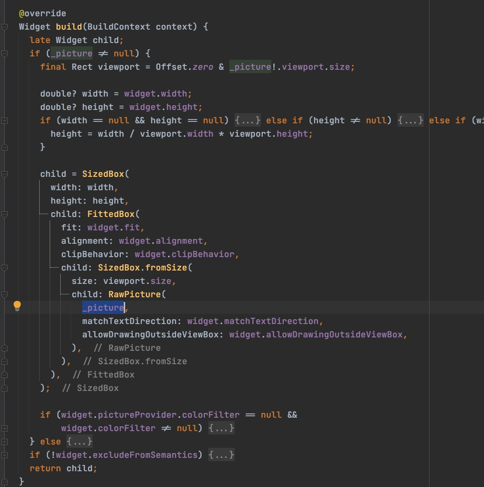
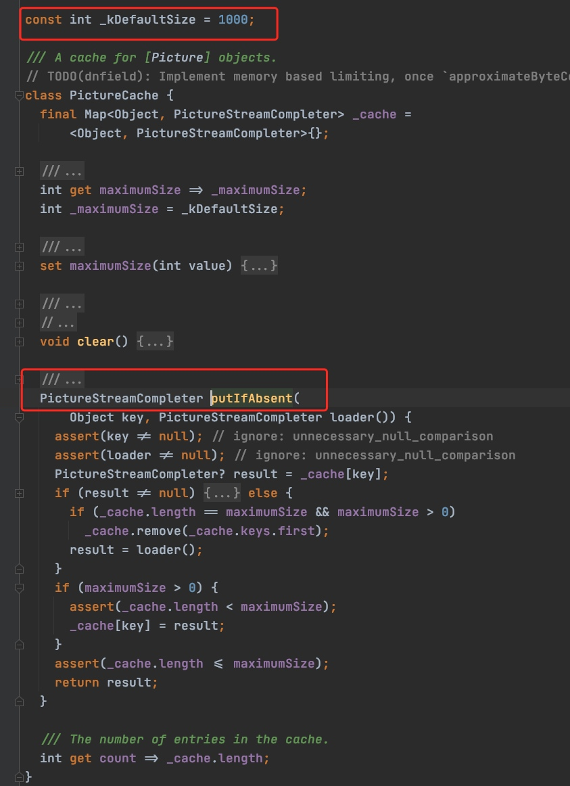

#Image的基本使用
Image是显示图片的一个Widget。image支持的图片格式为：JPEG, PNG, GIF, Animated GIF, WebP, Animated WebP, BMP, and WBMP。
image的基本使用方法:

|构造方法|描述|
|----|----|
|Image()|从ImageProvider中获取图片，从本质上看，下面的几个方法都是他的具体实现。|
|Image.asset(String name)|从AssetBundler中获取图片|
|Image.network(String url)|显示网络图片，参数为url|
|Image.file(File file)|从File中获取图片|
|Image.memory(Uint8List bytes)|从Uint8List中显示图片|
具体使用：
## image.asset加载资源图片
Flutter可以为当前设备加载适合其分辨率的图像。
首先要在根目录assets下,新建image文件夹，由于Flutter加载图片时需要2倍图、3倍图，默认图。所以需要同时新建2.0x和3.0x文件夹。

然后，在pubspec.yaml配置文件中，yaml是类似于xml的一种标记性语言，其中“-”表示数组。在这里，我们也可以使用下面的写法，加载整个资源文件图片：

使用资源图片文件(填入图片的全路径即可)：
Image.asset("assets/images/flutter.jpeg")
## Image.network加载网络图片
Image.network(
            'https://image1.guazistatic.com/qn210519171455ac369db6cfecbf11d017210f2986a031.jpg')
## Image.file加载图片文件
Image.file(File("/sdcard/flutter.jpeg"))
注意在AndroidManifest.xml中配置读写文件权限
## Image.memory加载缓存文件
Image.memory(bytes);
## fit属性的设置
fit属性可以控制图片的拉伸和挤压，这些都是根据图片的父级容器来的.

BoxFit.fill:全图显示，图片会被拉伸，并充满父容器。

BoxFit.contain:全图显示，显示原比例，可能会有空隙。

BoxFit.cover：显示可能拉伸，可能裁切，充满（图片要充满整个容器，还不变形）。

BoxFit.fitWidth：宽度充满（横向充满），显示可能拉伸，可能裁切。

BoxFit.fitHeight ：高度充满（竖向充满）,显示可能拉伸，可能裁切。

BoxFit.scaleDown：效果和contain差不多，但是此属性不允许显示超过源图片大小，可小不可大。
## repeat图片重复
ImageRepeat.repeat : 横向和纵向都进行重复，直到铺满整个画布。

ImageRepeat.repeatX: 横向重复，纵向不重复。

ImageRepeat.repeatY：纵向重复，横向不重复。

ImageRepeat.noRepeat:不重复。
## alignment图片对齐
Alignment.center:居中

Alignment.centerLeft:居左

Alignment.centerRight:居右

Alignment.topCenter:顶部居中

Alignment.topLeft:顶部居左

Alignment.topRight:顶部居右

Alignment.bottomCenter:底部居中

Alignment.bottomLeft:底部居左

Alignment.bottomRight:底部居右
## colorBlendMode图片颜色及混合模式

color为源图像，image为目标图像
BlendMode.clear:不显示源图像和目标图像。

BlendMode.src:仅显示源图像。

BlendMode.dst:仅绘制目标图像。

BlendMode.srcOver:源图显示到目标图像上，源图像在上面,透明区域显示目标图层。

BlendMode.dstOver:目标图像显示在源图像上，目标图像在上面。

BlendMode.srcIn: 显示源图像且仅显示两个图像重叠位置。目标图像不绘制，只有不透明度起作用。

BlendMode.dstIn:显示目标图像且仅显示两个图像重叠部分，源图像不绘制只有不透明度起作用。

BlendMode.srcOut:显示源图像且仅显示两个图像不重叠位置。目标图像不绘制，只有不透明度起作用。

BlendMode.dstOut:显示目标图像且仅显示两个图像不重叠部分，源图像不绘制只有不透明度起作用。

BlendMode.srcATop:将源图像合成到目标图像上，但仅在与目标图像重叠的位置合成。但是输出的不透明度通道设置为目标图像的不透明度通道，而不是两个图像的不透明度通道的组合。

BlendMode.dstATop:将目标图像合成到源图像上，但仅在与源图像重叠的位置合成。但是将输出的不透明度通道设置为源图像的不透明度通道，而不是将两个图像的不透明度通道组合在一起。

BlendMode.xor:对源图像和目标图像应用按位“ xor”运算符。这将使它们重叠的地方保持透明。

BlendMode.plus:对源图像和目标图像的组成部分求和。

BlendMode.modulate:将源图像和目标图像的颜色分量相乘。这只能产生相同或较深的颜色（乘以白色1.0，结果不变；乘以黑色0.0，结果黑色）。合成两个不透明图像时，这与在投影机上重叠两个透明胶片具有相似的效果。

BlendMode.screen:将源图像和目标图像的分量的逆值相乘，然后将结果相逆。反转分量意味着将完全饱和的通道（不透明的白色）视为值0.0，将通常视为0.0的值（黑色，透明）视为1.0。这本质上与[调制]混合模式相同，但是颜色的值在乘法之前先反转，结果在渲染前先反转。这只能导致颜色相同或更浅（乘以黑色1.0不会导致更改；乘以白色0.0则会导致白色）。同样，在Alpha通道中，它只能导致更不透明的颜色。这与两台投影机在同一屏幕上同时显示其图像的效果相似。

BlendMode.overlay:在将源图像和目标图像的分量调整为适合目标后，将它们相乘。具体而言，如果目标值较小，则将其与源值相乘，而当源值较小时，则将源值的逆与目标值的逆相乘，然后求反。反转分量意味着将完全饱和的通道（不透明的白色）视为值0.0，将通常视为0.0的值（黑色，透明）视为1.0。

BlendMode.darken:通过从每个颜色通道中选择最小值来合成源图像和目标图像,透明区域显示目标图层。

BlendMode.lighten:通过从每个颜色通道中选择最大值来合成源图像和目标图像,透明区域显示目标图层。

BlendMode.colorDodge:将目标除以源的倒数。反转分量意味着将完全饱和的通道（不透明的白色）视为值0.0，将通常视为0.0的值（黑色，透明）视为1.0。

BlendMode.colorBurn:将目标的倒数除以源，然后将结果倒数。反转分量意味着将完全饱和的通道（不透明的白色）视为值0.0，将通常视为0.0的值（黑色，透明）视为1.0。

BlednMode.hardLight:调整源图像和目标图像的分量以使其适合源图像后，将它们相乘。具体来说，如果源值较小，则将其与目标值相乘，而当目标值较小时，则将目标值的逆与源值的逆相乘，然后求反。反转分量意味着将完全饱和的通道（不透明的白色）视为值0.0，将通常视为0.0的值（黑色，透明）视为1.0

BlendMode.softLight: 对于低于0.5的源值使用[colorDodge]，对于高于0.5的源值使用[colorBurn]。与[overlay]相比，这会产生相似但较柔和的效果

BlendMode.difference: 从每个通道的较大值中减去较小的值。合成黑色没有效果。合成白色会使另一张图像的颜色反转。输出图像的不透明度的计算方法与[srcOver]相同。

BlendMode.exclusion: 从两个图像的总和中减去两个图像的乘积的两倍。合成黑色没有效果。合成白色会使另一张图像的颜色反转。输出图像的不透明度的计算方法与[srcOver]相同。效果类似于[difference]，但较柔和。

BlendMode.multiply: 将源图像和目标图像的分量相乘，包括alpha通道。这只能产生相同或较深的颜色（乘以白色1.0，结果不变；乘以黑色0.0，结果黑色）。由于alpha通道也被相乘，因此一幅图像中的全透明像素（不透明度0.0）导致输出中的全透明像素。这类似于[dstIn]，但将颜色组合在一起。对于多种颜色但不乘以Alpha通道的变体，请考虑[modulate]。

BlendMode.hue: 获取源图像的​​色相，以及目标图像的饱和度和光度。效果是用源图像对目标图像进行着色。输出图像的不透明度的计算方法与[srcOver]相同。源图像中完全透明的区域会从目标获得其相色。

BlendMode.saturation: 获取源图像的​​饱和度以及目标图像的色相和亮度。输出图像的不透明度的计算方法与[srcOver]相同。源图像中完全透明的区域从目标位置开始饱和。

BlendMode.color: 获取源图像的​​色相和饱和度以及目标图像的光度。效果是用源图像对目标图像进行着色。输出图像的不透明度的计算方法与[srcOver]相同。源图像中完全透明的区域从目标位置获得其色相和饱和度。

BlendMode.luminosity: 获取源图像的​​亮度，以及目标图像的色相和饱和度。输出图像的不透明度的计算方法与[srcOver]相同。源图像中完全透明的区域从目的地获取其亮度。

## centerSlice图片局部放大：

原图：

效果图：

# Image的源码

下面通过Image.network的源码来看下图片是如何下载以及如何缓存的

首先通过点击红色框可以看到网络加载的图片和AssetImage等都是image_provide的实现类，
它的主要职责有两个：
提供图片数据源
缓存图片
主要基类：
## resolve方法

 使用给定的“ configuration”解析此图像，并返回[ImageStream]。这是[ImageProvider]类层次结构的公共入口点。子类应实现此方法使用的[obtainKey]和[load]。如果他们需要更改使用的[ImageStream]的实现，则应重写[createStream]。如果他们需要管理图像的实际分辨率，则应重写[resolveStreamForKey]。
 
 ImageConfiguration 包含图片和设备的相关信息，如图片的大小、所在的AssetBundle(只有打到安装包的图片存在)以及当前的设备平台、devicePixelRatio（设备像素比等）。Flutter SDK提供了一个便捷函数createLocalImageConfiguration来创建ImageConfiguration 对象：

 ##具体看下resolve方法
 

有缓存则使用缓存，没有缓存则调用load方法加载图片，加载成功后:

先判断图片数据有没有缓存，如果有，则直接返回ImageStream。
如果没有缓存，则调用load(T key)方法从数据源加载图片数据，加载成功后先缓存，然后返回ImageStream。

这里的PaintingBinding.instance.imageCache 是 ImageCache的一个实例，它是PaintingBinding的一个属性，而Flutter框架中的PaintingBinding.instance是一个单例，imageCache事实上也是一个单例，也就是说图片缓存是全局的，统一由PaintingBinding.instance.imageCache 来管理。

这里是不是很熟悉。
来看一下ImageCache

可以看到：
_pendingImages正在加载中的图片队列
_cache缓存队列
缓存图片上线1000张，最大缓存100M

可以看到，这里检测缓存图片是否存在，存在则直接返回，不存在则删掉缓存中对应的key，然后缓存图片。

当缓存数量超过最大值或缓存大小超过最大缓存容量，则会清理到缓存上限以内。
 ## obtainKey方法

该接口主要是为了配合实现图片缓存，ImageProvider从数据源加载完数据后，会在全局的ImageCache中缓存图片数据，而图片数据缓存是一个Map，而Map的key便是调用此方法的返回值，不同的key代表不同的图片数据缓存。对应实现：

因为Map中在判断key（此时是NetworkImage对象）是否相等时会使用"="运算符，那么定义key的逻辑就是NetworkImage的“==”运算符：

这里可以看出key是由url+scale决定的，同一个url不同scale会重复下载。

## load方法

将密钥转换为[ImageStreamCompleter]，然后开始获取图像。 [decode]回调提供了获取图像编解码器的逻辑。
load方法的返回值类型是ImageStreamCompleter ，它是一个抽象类，定义了管理图片加载过程的一些接口，Image Widget中正是通过它来监听图片加载状态的。

MultiFrameImageStreamCompleter 是 ImageStreamCompleter的一个子类，是flutter sdk预置的类，通过该类，我们可以方便、轻松地创建出一个ImageStreamCompleter实例来做为load方法的返回值。

具体子类NetworkImage实现load

可以看到_loadAsync方法主要做了两件事：
1.下载图片。
2.对下载的图片数据进行解码。
这里获取图片，解码图片。具体解码图片是底层做的。

我们可以看到Codec最终的结果是一个或多个（动图）帧，而这些帧最终会绘制到屏幕上。

另外，我们需要注意的是，图片缓存是在内存中，并没有进行本地文件持久化存储，这也是为什么网络图片在应用重启后需要重新联网下载的原因。

# Image第三方控件
## flutter_svg控件
对于flutter_svg这个控件，因为我们看过flutter原生的image的解析和缓存过程了，在看这个控件就很简单了。首先我们看下这个控件对外提供的几个基本的使用方法。

可以看到，对外提供了这三种加载svg的方法。
下面我们也从SvgPicture.network来了解flutter_svg的源码。
### SvgPicture.network加载网络svg图片
首先看到这个方法存在于SvgPicture这个类里。

然后SvgPicture 他是一个StatefulWidget，然后这个类他必然后build和createState方法，这样我们直接去看他的build方法

可以看到build是绘制的_picture然后画出来的svg图片，这里_picture是一个包含Picture的用来绘制到canvas上的实体类。

Picture则是表示记录的图形操作序列的对象，可以使用[SceneBuilder]将[Picture]放置在[Scene]中。也可以使用[Canvas.drawPicture]方法将[Picture]绘制到[Canvas]中。
### URL中的byte加载到PictureInfo流程

首先看到NetworkPicture是从PictureProvider实现过来的。

PictureProvider有三个和ImageProvider一样的方法，其实起到的作用也一样，咱们这里就不详细说了。
resole：是公共入口，里面调用了obtainKey和load方法，然后子类要实现obtainKey和load方法。
obtainKey：通过PictureConfiguration获取图片的key作为唯一标识。
load：通过key加载图片返回PictureStreamCompleter，这样一个管理图片的对象。
#### 缓存

这里同样是有缓存则直接用缓存文件，没有则调用load方法从网络下载。和原生ImageProvider不同的是svg缓存只有一个限制最大1000个svg图片。

可以看到这里缓存svg图片，先判断是否有缓存，如果有直接用，如果没有判断是否超过最大缓存数量限制，如果超过移除第一个然后，从网络加载，先存到缓存然后返回。
#### 查看load实现。

同样的NetworkPicture中有通过url下载图片，最后_loadAsync返回PictureInfo，以及图片的key是由url+colorFilter组成，这样的代码。
那么bytes是怎么解析成PictureInfo的呢？

看到这里就很清楚了

然后看到这里是通过SvgParser解析得到的。到这里整个的svg图片加载实际就理顺了。

