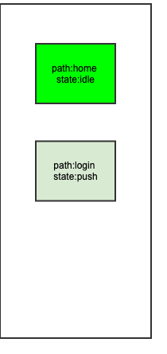

# 路由Push流程
一次Push流程的分析

## 关键代码

 NavigatorState
 ```dart
  @optionalTypeArgs
  Future<T?> pushNamed<T extends Object?>(
    String routeName, {
    Object? arguments,
  }) {
  ///_routeNamed方法
    return push<T>(_routeNamed<T>(routeName, arguments: arguments)!);
  }
 
  @optionalTypeArgs
  Future<T?> push<T extends Object?>(Route<T> route) {
    assert(_debugCheckIsPagelessRoute(route));
    _pushEntry(_RouteEntry(route, initialState: _RouteLifecycle.push));
    return route.popped;
  }
  
 void _pushEntry(_RouteEntry entry) {
    _history.add(entry);
    _flushHistoryUpdates();
    _afterNavigation(entry.route);
  }
  
///最关键的一个方法  
void _flushHistoryUpdates({bool rearrangeOverlay = true}) {
    assert(_debugLocked && !_debugUpdatingPage);
    // Clean up the list, sending updates to the routes that changed. Notably,
    // we don't send the didChangePrevious/didChangeNext updates to those that
    // did not change at this point, because we're not yet sure exactly what the
    // routes will be at the end of the day (some might get disposed).
    int index = _history.length - 1;
    _RouteEntry? next;
    _RouteEntry? entry = _history[index];
    _RouteEntry? previous = index > 0 ? _history[index - 1] : null;
    bool canRemoveOrAdd = false; // Whether there is a fully opaque route on top to silently remove or add route underneath.
    Route<dynamic>? poppedRoute; // The route that should trigger didPopNext on the top active route.
    bool seenTopActiveRoute = false; // Whether we've seen the route that would get didPopNext.
    final List<_RouteEntry> toBeDisposed = <_RouteEntry>[];
    while (index >= 0) {
      switch (entry!.currentState) {
        case _RouteLifecycle.add:
          assert(rearrangeOverlay);
          entry.handleAdd(
            navigator: this,
            previousPresent: _getRouteBefore(index - 1, _RouteEntry.isPresentPredicate)?.route,
          );
          assert(entry.currentState == _RouteLifecycle.adding);
          continue;
        case _RouteLifecycle.adding:
          if (canRemoveOrAdd || next == null) {
            entry.didAdd(
              navigator: this,
              isNewFirst: next == null,
            );
            assert(entry.currentState == _RouteLifecycle.idle);
            continue;
          }
          break;
        case _RouteLifecycle.push:
        case _RouteLifecycle.pushReplace:
        case _RouteLifecycle.replace:
          assert(rearrangeOverlay);
          entry.handlePush(
            navigator: this,
            previous: previous?.route,
            previousPresent: _getRouteBefore(index - 1, _RouteEntry.isPresentPredicate)?.route,
            isNewFirst: next == null,
          );
          assert(entry.currentState != _RouteLifecycle.push);
          assert(entry.currentState != _RouteLifecycle.pushReplace);
          assert(entry.currentState != _RouteLifecycle.replace);
          if (entry.currentState == _RouteLifecycle.idle) {
            continue;
          }
          break;
        case _RouteLifecycle.pushing: // Will exit this state when animation completes.
          if (!seenTopActiveRoute && poppedRoute != null)
            entry.handleDidPopNext(poppedRoute);
          seenTopActiveRoute = true;
          break;
        case _RouteLifecycle.idle:
          if (!seenTopActiveRoute && poppedRoute != null)
            entry.handleDidPopNext(poppedRoute);
          seenTopActiveRoute = true;
          // This route is idle, so we are allowed to remove subsequent (earlier)
          // routes that are waiting to be removed silently:
          canRemoveOrAdd = true;
          break;
        case _RouteLifecycle.pop:
          if (!seenTopActiveRoute) {
            if (poppedRoute != null)
              entry.handleDidPopNext(poppedRoute);
            poppedRoute = entry.route;
          }
          entry.handlePop(
            navigator: this,
            previousPresent: _getRouteBefore(index, _RouteEntry.willBePresentPredicate)?.route,
          );
          assert(entry.currentState == _RouteLifecycle.popping);
          canRemoveOrAdd = true;
          break;
        case _RouteLifecycle.popping:
          // Will exit this state when animation completes.
          break;
        case _RouteLifecycle.remove:
          if (!seenTopActiveRoute) {
            if (poppedRoute != null)
              entry.route.didPopNext(poppedRoute);
            poppedRoute = null;
          }
          entry.handleRemoval(
            navigator: this,
            previousPresent: _getRouteBefore(index, _RouteEntry.willBePresentPredicate)?.route,
          );
          assert(entry.currentState == _RouteLifecycle.removing);
          continue;
        case _RouteLifecycle.removing:
          if (!canRemoveOrAdd && next != null) {
            // We aren't allowed to remove this route yet.
            break;
          }
          entry.currentState = _RouteLifecycle.dispose;
          continue;
        case _RouteLifecycle.dispose:
          // Delay disposal until didChangeNext/didChangePrevious have been sent.
          toBeDisposed.add(_history.removeAt(index));
          entry = next;
          break;
        case _RouteLifecycle.disposed:
        case _RouteLifecycle.staging:
          assert(false);
          break;
      }
      index -= 1;
      next = entry;
      entry = previous;
      previous = index > 0 ? _history[index - 1] : null;
    }

    // Informs navigator observers about route changes.
    _flushObserverNotifications();

    // Now that the list is clean, send the didChangeNext/didChangePrevious
    // notifications.
    _flushRouteAnnouncement();

    // Announce route name changes.
    if (widget.reportsRouteUpdateToEngine) {
      final _RouteEntry? lastEntry = _history.cast<_RouteEntry?>().lastWhere(
        (_RouteEntry? e) => e != null && _RouteEntry.isPresentPredicate(e), orElse: () => null,
      );
      final String? routeName = lastEntry?.route.settings.name;
      if (routeName != null && routeName != _lastAnnouncedRouteName) {
        SystemNavigator.routeInformationUpdated(location: routeName);
        _lastAnnouncedRouteName = routeName;
      }
    }

    // Lastly, removes the overlay entries of all marked entries and disposes
    // them.
    for (final _RouteEntry entry in toBeDisposed) {
      for (final OverlayEntry overlayEntry in entry.route.overlayEntries)
        overlayEntry.remove();
      entry.dispose();
    }
    if (rearrangeOverlay) {
      overlay?.rearrange(_allRouteOverlayEntries);
    }
    if (bucket != null) {
      _serializableHistory.update(_history);
    }
  }
 ```

## 流程分析
为了方便起见，假设路由栈里面仅有一个首页（home），我们推入一个新的登录页面（login）。调用链：
1. NavigatorState.push<T extends Object?>(Route<T> route)
2. NavigatorState._pushEntry(_RouteEntry(route, initialState: _RouteLifecycle.push))
3. NavigatorState._flushHistoryUpdates()：这个方法会以从尾到头的方向遍历_history列表，此时_history列表中_RouteEntry的状态如下图


4. _RouteEntry.handlePush()：这个方法会将login页面的page添加到Overlay,
    1. Route.didPush():启动route配置的动画，并将_RouteEntry的状态设置为pushing，
    2. whenCompleteOrCancel：当动画结束将_RouteEntry的状态设置为idle
    3. 再次调用NavigatorState._flushHistoryUpdates()方法。
这里的2、3流程是异步回调。

5. 在4.1之后，继续循环遍历_history列表，现在只剩一个home的Entry，并且是idle状态的，所以并不会有什么操作。接下来进入_flushObserverNotifications()方法，这里有三个重要的属性：
    * _effectiveObservers：由Widget传递过来。也就是在MaterialApp配置的navigatorObservers属性。
    * _observedRouteAdditions：在add或者push的流程添加_NavigatorPushObservation、_NavigatorReplaceObservation
    * _observedRouteDeletions：在pop或者remove的流程添加_NavigatorPopObservation、_NavigatorRemoveObservation。

    ```dart
    void _flushObserverNotifications() {
    if (_effectiveObservers.isEmpty) {
      _observedRouteDeletions.clear();
      _observedRouteAdditions.clear();
      return;
    }
    
    ///1.当前流程
    while (_observedRouteAdditions.isNotEmpty) {
      final _NavigatorObservation observation = _observedRouteAdditions.removeLast();
      _effectiveObservers.forEach(observation.notify);
    }

    while (_observedRouteDeletions.isNotEmpty) {
      final _NavigatorObservation observation = _observedRouteDeletions.removeFirst();
      _effectiveObservers.forEach(observation.notify);
    }
  }
    ```
    目前只需要关心_observedRouteAdditions在push中添加_NavigatorPushObservation的情况。会进入注释1。一下代码就是_NavigatorPushObservation的notify方法的实现。以此类推可以猜测其他三种类型也是回调observer的对于方法。
    
    ```dart
      @override
      void notify(NavigatorObserver observer) {
        observer.didPush(primaryRoute, secondaryRoute);
      }
    ```
    

6. _flushRouteAnnouncement()：这个方法的作用是更新每个route的前后route，并使用Routed的didChangeNext、didChangePrevious来更新route本身的一些内容。

7. 将route的改变通知给平台（iOS、Android、Web等等），不用关心。
    

8. 通知Overlay更新图层
    ```dart
    for (final _RouteEntry entry in toBeDisposed) {
      for (final OverlayEntry overlayEntry in entry.route.overlayEntries)
        overlayEntry.remove();
      entry.dispose();
    }
    if (rearrangeOverlay) {
      overlay?.rearrange(_allRouteOverlayEntries);
    }
    ```
    
    