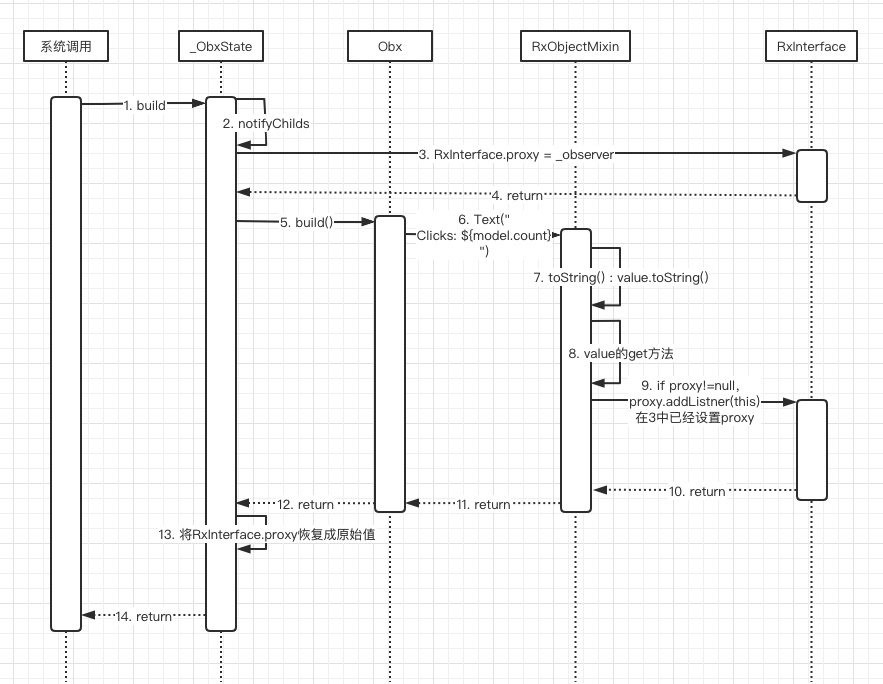

# GetX（一）从demo开始

Flutter是响应式编程架构，在Flutter开发中，经常遇到如何便捷的更新状态和如何方便快捷的传递上下文共享数据。

GetX提供了相应功能。

在GetX的官方demo中，演示了如何便捷高效的更新UI：
```dart
class HomePage extends StatelessWidget {
    final model = CountModel();
    
    @override
    Widget build(BuildContext context) {
        return Scaffold(
            // 使用Obx(()=>每当改变计数时，就更新Text()。
            appBar: AppBar(title: Obx(() => Text("Clicks: ${model.count}"))),
            body: Center(),
            floatingActionButton: FloatingActionButton(
              child: Icon(Icons.add),
              onPressed: () => model.count++,
        ));
    }
}

class CountModel {
    var count = 0.obs;
}
```
> 在上述代码中，更改了部分官方代码，以便简化代码，突出重点

在上述代码中我们看到，我们使用了一个StatelessWidget，做到了UI更新，非常的神奇。

上面的代码和我们平时动态更新ui的代码有三处不同：**CountModel中的0.obs、使用了StatelessWidget、Obx(() => Text("Clicks: ${model.count}"))**。

下面我们对新出现的obs和Obx实现进行学习，尝试解开其中神奇的魔力来源。

## 0.obs中的魔法
看到GetX中**0.obs**语法，那么他必然是使用了Dart中的**扩展语法**，源码如下：
```dart
// rx_impl.dart

extension IntExtension on int {
    /// Returns a `RxInt` with [this] `int` as initial value.
    RxInt get obs => RxInt(this);
}

extension StringExtension on String {
    /// Returns a `RxString` with [this] `String` as initial value.
    RxString get obs => RxString(this);
}

extension DoubleExtension on double {
    /// Returns a `RxDouble` with [this] `double` as initial value.
    RxDouble get obs => RxDouble(this);
}

extension BoolExtension on bool {
    /// Returns a `RxBool` with [this] `bool` as initial value.
    RxBool get obs => RxBool(this);
}

extension RxT<T> on T {
    /// Returns a `Rx` instace with [this] `T` as initial value.
    Rx<T> get obs => Rx<T>(this);
}
```

从上述源码可知，GetX支持**String、Int、Double、Bool、T**，所以任意类型都可以使用 **.obs** 。

以int为例，进一步看一下具体实现。

我们知道，在Dart中一个类可以通过**extends、implement、mixin**三种方式集成其他类的功能。如果单说继承不足以描述三种实现方式。**extends**是传统的继承方式，**implements**是传统的接口实现方式，**mixin**是Dart中直接集成其他类功能的方式。

当我们调用**0.obs**时，他的返回类型其实为**RxInt**。

而RxInt类的继承关系如下图：


其实其他的**RxString、RxDouble、RxBool、Rx<T>**都是**_RxImpl的子类**，而其中的间接父类只是提供了对应类型的自有能力，例如RxInt可以支持加减乘除等数字操作，而这些能力来源于间接父类_BaseRxNum和他本身。

所以我们可以猜到，_RxImpl其实是支持魔法的根源。

_RxImpl类分两部分组成，mixin进来的**RxObjectMixin**和继承进来的**RxNotifier**。

* RxNotifier
    首先我们看一下**RxObjectMixin**，代码如下：
    ```dart
        // 绑定的数据
        T _value;
        // 刷新，转入了subject方法
        void refresh() {
            subject.add(value);
        }
    
        // 设置空值
        void nil() {
            subject.add(_value = null);
        }
        
        // 提供直接括号的语法糖调用方式
        T call([T v]) {
            if (v != null) {
                value = v;
            }
            return value;
        }
    
        // .... 省略了一些hash == 等方法
        
        // 设置value，如果不是首次build，并且值相同则不更新。
        // 将新的value转入subject
        set value(T val) {
            if (_value == val && !firstRebuild) return;
            firstRebuild = false;
            _value = val;
            subject.add(_value);
        }
        
        // 当获取value时，查看proxy是否为null，不为null时则使用subject监听proxy
        T get value {
            if (RxInterface.proxy != null) {
                RxInterface.proxy.addListener(subject);
            }
            return _value;
        }
    ```
    
    从上面的代码可知，**RxObjectMixin提供了数据绑定以及方便的刷新等方法**。
    
    而subject不属于RxObjectMixin类，则他必然来自**RxNotifier**。
    
    > 这里需要注意的是value的get方法中的RxInterface.proxy，后面我们会再遇到RxInterface.proxy。

* RxNotifier
    通过上面的分析可知，RxInt**数据绑定的能力来自RxObjectMixin**，那么他**数据监听和更新的能力**，必然来自**RxNotifier**(只有两个父类，所以另一部分能力必然来自它)。
    
    由上图可知，**RxNotifier实现了RxInterface接口**，而RxNotifier的代码如下：
    ``` dart
    class RxNotifier<T> = RxInterface<T> with NotifyManager<T>;
    ```
    
    我们看到，RxNotifier并没有自己的实体，所以接口RxInterface定义的方法，都由NotifyManager实现。
    
    而NotifyManager类确实实现了RxInterface功能定义，大体源码如下：
    ``` dart
    // 低层的监听果然使用的是流
    GetStream<T> subject = GetStream<T>();
    // 流的订阅者
    final _subscriptions = <GetStream, List<StreamSubscription>>{};
    
    bool get canUpdate => _subscriptions.isNotEmpty;
    
    // 将当前stream的add回调，添加到入参流rxGetx的事件监听中。当rxGetx发生变化时会回调subject.add，并将订阅者添加到_subscriptions中，以便关闭和资源回收。
    void addListener(GetStream<T> rxGetx) {
        if (!_subscriptions.containsKey(rxGetx)) {
            final subs = rxGetx.listen(subject.add);
            final listSubscriptions = _subscriptions[rxGetx] ??= <StreamSubscription>[];
            listSubscriptions.add(subs);
        }
    }
    
    // 添加事件流更改时的监听
    StreamSubscription<T> listen( void Function(T) onData, { Function onError, void Function() onDone, bool cancelOnError = false,
        }) => subject.listen(onData, onError: onError, onDone: onDone, cancelOnError: cancelOnError);
    
    // 关闭订阅者等资源
    void close() {
        ....
    }
    ```
    
    从上述源码中可知，RxNotifier提供了两个东西：真正的流GetStream、将其他GetStream的事件变更转发到当前持有的GetStream。
    
    由此可知GetStream提供了所有的流事件的管理和分发。
    
* GetStream
    **GetStream**提供了一系列的监听方法，用于对流的状态监听。提供了一系列的管理方法，用于管理订阅者和事件分发。源码如下：
    ``` dart
    class GetStream<T> {
        // 当添加新的监听时的回调方法
        void Function() onListen;
        // 当订阅者暂停时的回调
        void Function() onPause;
        // 当订阅者恢复时的回调
        void Function() onResume;
        // 当前流cacenl时的回调
        FutureOr<void> Function() onCancel;
        // 为当前流移除订阅者
        FutureOr<bool> removeSubscription(LightSubscription<T> subs);
        // 为当前流添加订阅者
        FutureOr<void> addSubscription(LightSubscription<T> subs);
        // 数据变化时更新所有订阅者
        void _notifyData(T data);
        // 发生错误时，通知所有订阅者
        void _notifyError(Object error, [StackTrace stackTrace]);
        // 流完成时通知订阅者
        void _notifyDone();
        // 当前流最后一个事件对象
        T _value;
        // 添加事件
        void add(T event) {
            _value = event;
            // 转发到_notifyDate()
            _notifyData(event);
        }
        // 给当前流添加新的监听
        LightSubscription<T> listen(void Function(T event) onData,{Function onError, void Function() onDone, bool cancelOnError}) {
            final subs = LightSubscription<T>(removeSubscription,onPause: onPause,onResume: onResume,onCancel: onCancel,)
            ..onData(onData)
            ..onError(onError)
            ..onDone(onDone)
            ..cancelOnError = cancelOnError;
            addSubscription(subs);
            onListen?.call();
            return subs;
        }
        
        // 将GetStream转化为流的方式返回。
        Stream<T> get stream => GetStreamTransformation(addSubscription, removeSubscription);
    }
    ```
    
    在上述源码中，使用到了**LightSubscription**，他只是对订阅者的简单封装，有兴趣的同学可以自行查看。

至此通过源码发现，所有的可观察类都是**_RxImpl的子类**，**他提供了数据绑定(RxObjectMixin)和数据变化时的事件管理和分发(RxNotifier)**的能力。

然而事件分发给谁呢？我们根据counter功能大胆推测一下，数据的变更事件可能都分发给了Obx()，从而促使Obx进行更新，最终UI更新。

## Obx(() => Text("Clicks: ${model.count}"))
在Flutter中，如果需要更新UI，在不使用黑魔法的前提下，我们推测GetX内部大概率同样使用了StatefulWidget。

通过源码可知，Obx的继承关系为：**Obx -> ObxWidget -> StatefulWidget**。

到此可知，Obx的更新确实是基于**StatefulWidget**。

ObxWidget对应的State为**_ObxState**，源码如下：
```dart
class _ObxState extends State<ObxWidget> {
    // 当前持有的观察者对象
    RxInterface _observer;
    // 当前的订阅者对象
    StreamSubscription subs;

    _ObxState() {
        // RxNotifier上文提到过，提供了事件的监听管理和分发
        _observer = RxNotifier();
    }
    
    @override
    void initState() {
        // 对观察者添加监听，当_observer内容发生变化时，触发_updateTree
        subs = _observer.listen(_updateTree);
        super.initState();
    }
    
    // 调用setState触发更新
    void _updateTree(_) {
        if (mounted) {
            setState(() {});
        }
    }
    
    // 关闭观察者，取消订阅者
    @override
    void dispose() {
        subs.cancel();
        _observer.close();
        super.dispose();
    }
    
    // 调用widget中的build，更新child。
    Widget get notifyChilds {
        final observer = RxInterface.proxy;
        RxInterface.proxy = _observer;
        final result = widget.build();
        if (!_observer.canUpdate) {
            // 抛出错误，省略...
        }
        RxInterface.proxy = observer;
        return result;
    }

    @override
    Widget build(BuildContext context) => notifyChilds;
}
```

通过上面的源码可知，**_ObxState**基本上都是对**_observer**的监听等操作的处理。

**当_observer发生变化时，更新当前widget。当前widget回收时，关闭_observer并取消订阅者。**

然而并没有发现counter更改时，如何触发widget更改。

我们在分析**RxObjectMixin**的源码时曾经看到其中_value的get方法，有一段如下源码：
```dart
// 当获取value时，查看proxy是否为null，不为null时则使用subject监听proxy
T get value {
    if (RxInterface.proxy != null) {
        RxInterface.proxy.addListener(subject);
    }
    return _value;
}
```

而_ObxState中的**notifyChilds**方法为：
```dart
// 调用widget中的build，更新child。
Widget get notifyChilds {
    final observer = RxInterface.proxy;
    RxInterface.proxy = _observer;
    final result = widget.build();
    if (!_observer.canUpdate) {
        // 抛出错误，省略...
    }
    RxInterface.proxy = observer;
    return result;
}
```

在此方法中，同样有对**RxInterface.proxy**的操作。他将原来的proxy存入临时变量，并将当前_observer设置为全局proxy，再调用build。完成以后再恢复原始proxy。一顿蜜汁操作。。。

我们看一下在notifyChilds方法的具体调用链路，如下：



如上图所示，在（3）中_ObxState将**proxy设置为_observer**，而在（6）中`Text("Clicks: ${model.count}")`，系统会将String拼串操作转换为`Text("Clicks: ${model.count.toString()}")`，触发了（7）的toString()，而toString()的实现为：`value.toString()`，使用了**value对象**，从而触发了value的**get方法**（8）、（9），在**get方法**中使用（3）中设置的_observer(_ObxState中的对象)监听当前counter上的事件变更。一系列调用完成后，在（13）中再将proxy恢复成原始proxy。

这也解释了在notifyChilds()方法中替换proxy的蜜汁操作。

当_ObxState回收时，同时回收事件订阅器，以及关闭当前_observer对象。

## 总结
我们从头再理一下思路。

count通过**扩展的方式**，获取到了一个支持**数据绑定(RxObjectMixin)**和**数据事件分发(RxNotifier)**的**Rx**对象。

当系统构建UI时，调用_ObxState的**build()**方法，从而以隐式的方式调用**count.toString()**方法，而**RxObjectMixin.toString()**方法又隐式的调用了**value的get方法**。在**get方法**中，由于之前的**proxy交换操作**，致使当前proxy为当前**_ObxState._observer**，最终将value的**数据变更流**整合到了**_ObxState._observer**中。

当count变更时，触发他自己的事件流，同时触发_ObxState._observer的事件流，最终更新UI。

这一步proxy变换和value的get操作，堪称神来之笔，膜拜~

同时，通过源码可知，在Obx的build回调中不可轻易更改proxy，否则将导致proxy链接到的对象错误，从而导致不能正确分发事件，不能更新UI。

但是**在Obx中可同时多层嵌套Obx**，因为每次build时都会恢复成之前的proxy。

### 思考
* 如果在Rx对象中不使用Stream
    其实在Rx对象的实现中并没有直接使用Stream，**GetStream**也只是借鉴了Stream的事件思想以及分发套路。value值的变更是事件的原动力，每次变更都会对应一次事件的生成。同时又需要将事件分发给所有的订阅者们，以便订阅者更新自己。这个套路就是Stream的广播订阅模式。
    * 为什么不使用Stream
        虽然GetStream叫Stream，但是他并不是Stream的子类。作为Flutter中的基础框架类，Stream提供的能力更加庞杂，更加多变。然而GetStream并不需要这么庞杂的能力，只需要聚焦到事件管理和分发就可以了。
* 如果有更多的更新元素
    我们通过源码分析可以知道，每个可更新元素都对应两个**NotifyManager**，两个**GetStream**，每多增加一个Obx都会增加一套相应的对象用来完成订阅。而每套对象中又包含相应的配套对象。虽然多次调用setState并不会触发帧的更新，但是仍然会有很多对象生成，以及很多关联调用。例如在列表更新中，GetX提供了GetBuilder和GetX用于批量更新。那让我们看一下他是如何提高效率的。
        

## Get.put(instance)分析
* GetxController

    **GetxController**类提供了两个功能：生命周期管理、广播内容变化
    
    * 对于**生命周期管理**，它继承了**GetLifeCycleBase**类，提供了：onInit()、onReady()、onClose()。
    **onInit()**回调方法在当前controller被加载到内存中后，第一时间调用。
    **onReady()**方法在下一帧刷新时调用，一般用来处理dialog之类需要下一帧时机
    **onClose()**方法用来处理一些资源回收。
    
    * 对于**广播内容变化**功能，GetxController提供了update()方法，用于更新订阅者。
    
* **put()**方法实现
    通过调用put()方法，将实例添加到了GetX中名为**_singl**的静态map中，再直接通过**find()**方法返回传入实例。
    
    find()方法，会从**_singl**中查找，并检查是否已经初始化。
    * 如果未初始化，则直接调用传入的build方法(如果没有传入build则默认生成一个build方法，返回传入的实例)，获取实例。
    * 获取完成实例以后，会检查当前实例是否为**GetLifeCycleBase**类型，我们前面分析**GetxController**类时已经说明，他通过继承**GetLifeCycleBase**，提供了生命周期方法。
    * 如果当前实例为**GetLifeCycleBase**类型，则调用其**onStart()**回调方法
    * 尝试将当前route引用加入到route列表中
    