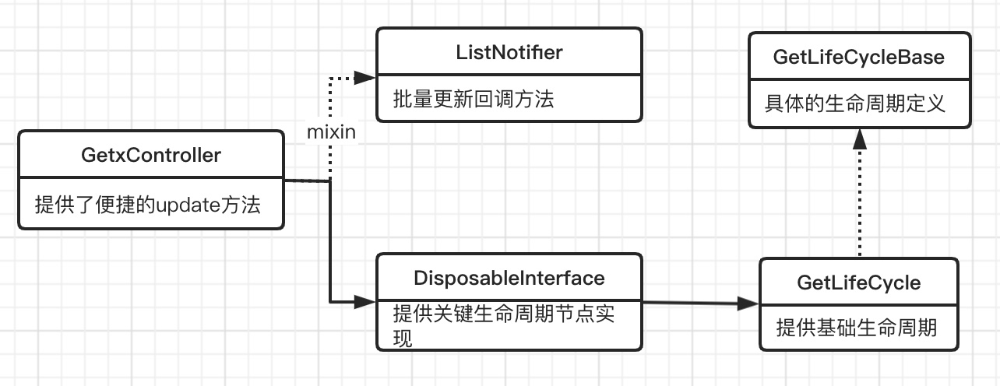

# GetX（二）GetxController和GetX
在上文中的官方demo部分，我们贴出的源码是简单改动过的。

而改动的部分主要是将CountModel由**GetxController**的子类，更换为了普通对象。

下面我们一块学习一下**GetxController**源码。

## 1. GetxController的实现
先不说其他，先看一下GetxController的继承结构，如下图：



由上图可知，GetxController通过继承**DisposableInterface**和mixin **ListNotifier**的方式，提供了**生命周期和批量更新**的能力。

* DisposableInterface
    
    DisposableInterface通过继承GetLifeCycle，提供了如下生命周期方法：
    * **onStart** 虽然是Function类型，但是以final变量的方式存在，用来防止子类重写。本方法将在widget被加载到内存中时由框架调用。此方法的默认实现会检查是否已经初始化，如果没有，则调用onInit()方法，所以多次调用onStart，只会执行一次onInit()
    * **onInit()** 本方法会在widget被加载到内存中后调用。一般用来初始化一些后续需要使用的对象。
    * **onReady()** 此方法会比onInit()方法晚调用一帧，此方法一般用于执行snackbar、新的路由等需要页面init完成后执行的操作。
    * **onDelete** 和onStart很类似，也是用于框架调用的final变量类型的Function。默认会关联调用onClose()，并且执行多次，也只会执行一次onClose()。
    * **onClose()** 此方法用于回收资源，类似Widget中的dispose方法。
    
    对于**onReady()**方法的描述，我们知道他会在**onInit()**的下一帧调用，我们看一下源码的实现方式：
    ``` dart
    @override
    @mustCallSuper
    void onInit() {
        super.onInit();
        SchedulerBinding.instance?.addPostFrameCallback((_) => onReady());
    }
    ```
    
    我们看到要达到这个效果，这里使用的是`SchedulerBinding.instance?.addPostFrameCallback`的方式，类似的还有`addPersistentFrameCallback`方法，有兴趣的童鞋可以了解一下Flutter的加载流程。
    
* ListNotifier
    既然是一起看源码，那先上酸菜：
    ``` dart
    class ListNotifier implements Listenable {
        // 忽略了部分不重要的代码
        
        List<GetStateUpdate> _updaters = <GetStateUpdate>[];
        
        HashMap<Object, List<GetStateUpdate>> _updatersGroupIds = HashMap<Object, List<GetStateUpdate>>();

        @protected
        void refresh() {
            if (_microtask == _version) {
                _microtask++;
                // 异步更新
                scheduleMicrotask(() {
                    _version++;
                    _microtask = _version;
                    _notifyUpdate();
                });
            }
        }
        
        // 简单的更新逻辑
        void _notifyUpdate() {
            for (var element in _updaters) {
                element();
            }
        }
        
        // 按照组id进行更新
        void _notifyIdUpdate(Object id) {
            if (_updatersGroupIds.containsKey(id)) {
                final listGroup = _updatersGroupIds[id];
                    for (var item in listGroup) {
                    item();
                }
            }
        }

        @protected
        void refreshGroup(Object id) {
            // 异步更新
            if (_microtask == _version) {
                _microtask++;
                scheduleMicrotask(() {
                    _version++;
                    _microtask = _version;
                    _notifyIdUpdate(id);
                });
            }
        }
        
        // 在更新队列_updaters中添加setState方法
        @protected
        void notifyChildrens() {
            TaskManager.instance.notify(_updaters);
        }
        
        // 删除了部分增加、删除监听的方法
    }
    ```
    
    由上面的源码可知，ListNotifier提供了两种注册方式：**以单个的方式注册更新、以组的方式注册更新**。
    
    我们知道Flutter是单线程运行的，在Flutter启动过程中会维护两个队列：**EventQueue和MicroTaskQueue**。
    
    每次ticker触发时，都会执行两个队列，其中MicroTaskQueue的优先级要高于EventQueue。只有当task执行完成以后，才会执行EventQueue中的内容。
    
    这里使用scheduleMicrotask()方法执行具体的更新操作，可以不阻塞调用方，将具体更新放到下次ticker执行，并且在下次绘制之前得到执行。
    
## 2. GetX的自动更新
GetX的官方demo中是这样介绍GetX的：
```dart
// controller
final count1 = 0.obs;
final count2 = 0.obs;
int get sum => count1.value + count2.value;

// 视图
GetX<Controller>(
  builder: (controller) {
    print("count 1 rebuild");
    return Text('${controller.count1.value}');
  },
),
GetX<Controller>(
  builder: (controller) {
    print("count 2 rebuild");
    return Text('${controller.count2.value}');
  },
),
GetX<Controller>(
  builder: (controller) {
    print("count 3 rebuild");
    return Text('${controller.sum}');
  },
),
```
如果我们把**count1.value++**递增，就会打印出来：
* count 1 rebuild
* count 3 rebuild

如果我们改变**count2.value++**，就会打印出来。
* count 2 rebuild
* count 3 rebuild

**因为count2.value改变了，sum的结果现在是2。**

从Demo看，可能会有三个问题：
1. GetX是如何做到自动更新的？
2. Controller和GetX是如何交互的？
3. sum没有使用Rx，但是count1、count2更新时，他同样触发了更新，是如何做到的？

在看源码的过程中，带着这三个问题，我们一步步寻找答案。

### 2.1. GetX的自动更新
我们前一篇已经分析过Obx是如何自动更新的，我们已经了解到Obx是如何巧妙的使用全局proxy替换，以及如何巧妙的使用Rx对象的get方法。

我们推测GetX也是基于StatefulWidget的能力进行的UI重绘，也是使用了相同的套路进行事件流监听。

GetX的源码如下：
```dart
class GetX<T extends DisposableInterface> extends StatefulWidget {
  final GetXControllerBuilder<T> builder;
  final bool global;
  final bool autoRemove;
  final bool assignId;
  final void Function(State state) initState, dispose, didChangeDependencies;
  final void Function(GetX oldWidget, State state) didUpdateWidget;
  final T init;
  final String tag;

  const GetX({
    this.tag,
    this.builder,
    this.global = true,
    this.autoRemove = true,
    this.initState,
    this.assignId = false,
    this.dispose,
    this.didChangeDependencies,
    this.didUpdateWidget,
    this.init,
  });

  @override
  GetXState<T> createState() => GetXState<T>();
}
```

从上述源码可见：
* GetX确实是使用的StatefulWidget进行的UI更新
* GetX的入参泛型**T**是**DisposableInterface**的子类，而DisposableInterface我们前面已经分析过，他主要提供声明周期的功能。所以T类型时具有声明周期的类型，可以是GetXController类型。
* GetX提供了一些类似State中的回调方法，用于将State回调时机给到使用方。
* GetX还提供了诸如global、tag等入参，我们通过对State的分析，再看具体作用。

从上述源码可以看到GetX是StatefulWidget，对应GetXState类，我们再详细看一下其中的源码：
```dart

class GetXState<T extends DisposableInterface> extends State<GetX<T>> {
  GetXState() {
    _observer = RxNotifier();
  }
  RxInterface _observer;
  
  // 省略部分代码

  Widget get notifyChildren {
    final observer = RxInterface.proxy;
    RxInterface.proxy = _observer;
    final result = widget.builder(controller);
    if (!_observer.canUpdate) {
      throw "错误提示";
    }
    RxInterface.proxy = observer;
    return result;
  }

  @override
  Widget build(BuildContext context) => notifyChildren;
}
```

从上述源码可知，和我们推测的一致，GetX也使用了proxy的交换技巧，用以远端设置观察者。

### 2.2. GetX和GetxController的交互
除了上述源码，State中还有一部分源码，用于和Controller进行交互，如下：
```dart
// GetXState源码
T controller;
bool isCreator = false;
StreamSubscription subs;
    
@override
void initState() {
    // 1
    var isRegistered = GetInstance().isRegistered<T>(tag: widget.tag);
    
    // 2
    if (widget.global) {
        if (isRegistered) {
            if (GetInstance().isPrepared<T>(tag: widget.tag)) {
                isCreator = true;
            } else {
                isCreator = false;
            }
            controller = GetInstance().find<T>(tag: widget.tag);
        } else {
            controller = widget.init;
            isCreator = true;
            GetInstance().put<T>(controller, tag: widget.tag);
        }
    } else {
        // 3
        controller = widget.init;
        isCreator = true;
        controller?.onStart();
    }
    // 4
    widget.initState?.call(this);
    if (widget.global && Get.smartManagement == SmartManagement.onlyBuilder) {
        controller?.onStart();
    }
    // 5
    subs = _observer.listen((data) => setState(() {}));
    super.initState();
}
```
上述代码的作用如下：
1. GetInstance类提供了跨页面的实例共享与管理。我们暂且不讨论。isRegistered()方法用于判断指定类型下的指定tag对象是否已经在框架中注册。
2. controller对象如果是全局对象(global=true)，则再检查对象是否已准备就绪。在GetInstance中，如果一个对象已经被init或者对象没有被注册，isPrepared()都会返回false，所以这里先使用isRegistered()确保对象已经被注册，然后使用isPrepared()判断对象是否已经被加载。
    * 如果被加载，则标记controller的创建者为当前state，也就是isCreator=true。
    * 则使用widget.init初始对象，注册到Get中，并设置isCreator=true
3. 如果controller对象是局部对象(global=false)，并且直接将widget.init设置为controller，并调用他的onStart()方法，开启生命周期。
    * 我们在分析GetXController的时候知道，onStart()会调用onInit()方法，所以Controller.onInit()对应State.onInit()。而onReady()方法会在下一帧调用，也就是会在onInit()之后调用。
4. Get.smartManagement是对GetX中共享对象的管理策略，我们暂时不讨论。
5. 设置当observer的数据流发生变化时，调用setState。和Obx中相似，但是Obx判断了当前State的状态，感觉Obx中的处理会更安全。

其实GetX控件中还有部分代码没有贴出来，基本上都是转发didChangeDependencies()之类的，以及dispose的时候，根据isCreator，是否移除controller对象。

看完GetState的源码以后，我们回过头再仔细看一下GetX的定义：
```dart
class GetX<T extends DisposableInterface> extends StatefulWidget {
  final GetXControllerBuilder<T> builder;
  final bool global;
  final bool autoRemove;
  final bool assignId;
  final void Function(State state) initState, dispose, didChangeDependencies;
  final void Function(GetX oldWidget, State state) didUpdateWidget;
  final T init;
  final String tag;

  const GetX({
    this.tag,
    this.builder,
    this.global = true,
    this.autoRemove = true,
    this.initState,
    this.assignId = false,
    this.dispose,
    this.didChangeDependencies,
    this.didUpdateWidget,
    this.init,
  });
}
```
* tag 我们从State的源码知道，这个tag定义的是从Get中获取共享变量时的key值。所以如果前后两个页面共享相同实例，当tag有自定义的时候，则前后必须一致。
* builder 构建真正的显示Widget.
* global 定义controller变量是否为全局的。
    * 如果不是全局，则会使用init作为controller，跟随当前Widget的生命周期而回收。
    * 如果是全局，则会查找Get中是否有共享实例。
        * 如果没有，使用init参数作为默认controller，并添加到Get中管理。关于是否回收，需要有autoRemove参数决定。
        * 如果有，则复用共享实例。
* autoRemove 如果判断出当前实例是由当前widget所create，则会判断此变量，从而在State.dispose()的时候回收共享实例。
* initState、dispose、didChangeDependencies、didUpdateWidget 方法会在State相应方法被调用时，进行回调。
* assignId 如果此变量为true，则Get中的实例controller，不论是不是当前create的，都会根据autoRemove尝试回收。
* init 默认controller对象。
    * 如果global=false，则直接使用此入参为controller。并在dispose的时候根据autoRemove进行删除
    * 如果global=true，则会尝试从Get中加载指定tag以及类型的共享实例，如果没有，则使用init作为默认参数。同样，在dispose的时候根据 是否为当前create或者是否是assignId，以及 是否autoRemove 进行删除

通过源码阅读我们知道GetX是响应式的自动更新，可以设置controller共享对象，并支持controller的自动回收。但是因为这里的controller对象不是真正的GetXController，所以不支持controller内部的update。

GetX和Obx他们都是响应式自动更新，但是两者最大的区别在于GetX支持很多State生命周期的回调，以及controller的实例共享和生命周期触发。

可以认为Obx是轻量级的GetX实现。

### 2.3. sum是如何更新的
我们再回过头来看之前提到的官方demo中sum的问题：sum没有使用Rx，但是count1、count2更新时，他同样触发了更新，是如何做到的？

我们通过分析GetX的代码知道，GetX使用了和Obx相同的proxy互换的技巧提供响应式更新。

其实在build第三个GetX的时候使用了sum，sum就会同步使用count1和count2，当调用他们的get方法时，此时的proxy是当前GetX中的observer，所以count1和count2都会再设置GetX中的observer到流监听中。此时count1被GetX1和GetX3监听，count2被GetX2和GetX3监听，所以当他们任意一个改变时都会触发GetX3的更新。

### 3. 总结
GetxController通过继承**DisposableInterface**和mixin **ListNotifier**的方式，提供了**生命周期和批量更新**的能力。

而GetX要求入参为**DisposableInterface**类型，实现了共享实例生命周期的维护。与Obx相同，使用了proxy交换的方式，实现了响应式更新。

我们这里的GetxController中的更新能力在GetX中没有使用(入参是DisposableInterface类型)，但是在后面的GetBuilder中将发挥作用。