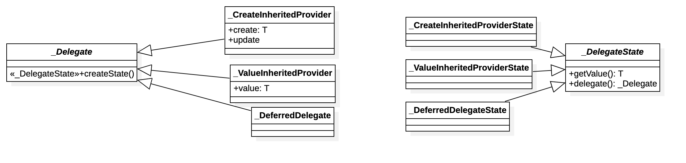
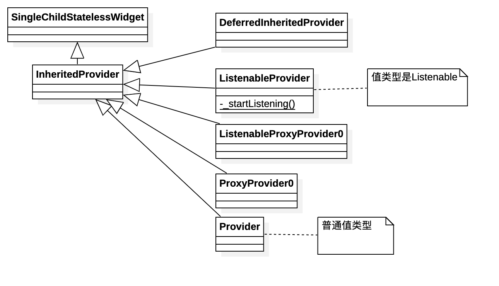
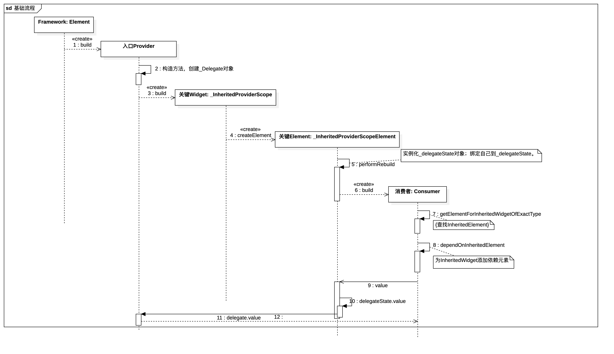
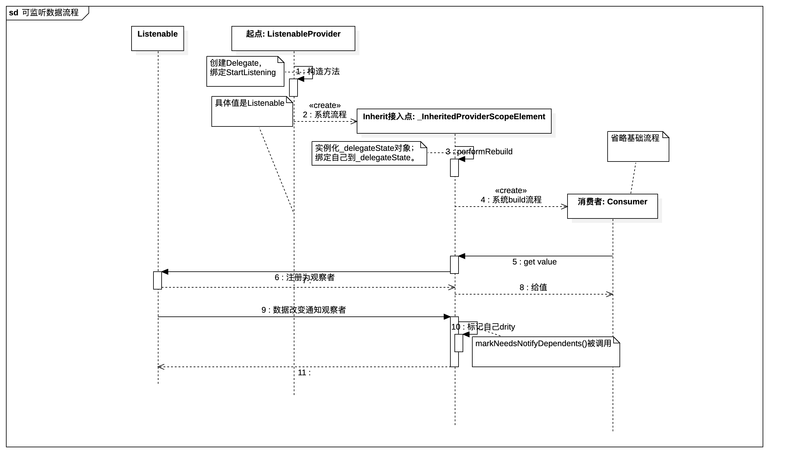

# Provider结构介绍
Provider的实现依赖于Flutter系统框架的InheritedWidget。这个库的介绍：InheritedWidget 组件的上层封装， 使其更易用， 更易复用。
几个主要的类：
1. _Delegate：提供值。
2. _DelegateState：管理值。
3. InheritedProvider：面向用户的接口，实际上我们使用其子类。
4. _InheritedProviderScopeElement：提供嵌入系统Inherit功能的能力。
5. Consumer、Selector：使用方，实际编码会使用。

## _Delegate与_DelegateState
* _Delegate：本身是一个抽象类，仅提供一个createState接口。它提供值的能力由子类来实现。
* DelegateState：本身是一个抽象类，本身是用于管理值，与值对象交互。

从名字上看，_Delegate与_DelegateState应该是成对的东西。看一下结构图。


### _CreateInheritedProviderState
以_CreateInheritedProviderState为代表分析，其他几个可能会复杂一些。主线很清晰，就是看有没有初始化过，如果没有，找_CreateInheritedProvider要一个。后面就把值直接给出去。

## InheritedProvider
我们经常使用的是其各种子类，但是主线逻辑在这里实现。先看类图：


InheritedProvider的构造方法生成_Delegate，并持有者这个_Delegate。看关键方法buildWithChild
```
@override
  Widget buildWithChild(BuildContext context, Widget? child) {
    return _InheritedProviderScope<T>(
      owner: this,
      // ignore: no_runtimetype_tostring
      debugType: kDebugMode ? '$runtimeType' : '',
      child: builder != null
          ? Builder(
              builder: (context) => builder!(context, child),
            )
          : child!,
    );
  }
```
在其中使用了InheritedWidget=>_InheritedProviderScope。那么如何接入系统Inherit机制就很清晰了。

## _InheritedProviderScopeElement

1. 关键方法notifyClients的调用。
它自己管理了notifyClients方法的调用，完全放弃使用框架的。

_InheritedProviderScope
```
  @override
  bool updateShouldNotify(InheritedWidget oldWidget) {
    return false;
  }
```

_InheritedProviderScopeElement
```
  @override
  void updated(InheritedWidget oldWidget) {
    super.updated(oldWidget);
    if (_updatedShouldNotify) {
      notifyClients(oldWidget);
    }
  }
```
_InheritedProviderScopeElement=>super.updated会调用_InheritedProviderScope=>updateShouldNotify来询问是否要通知依赖Element来更新自己。这里直接返回false，说明都不更新。而_InheritedProviderScopeElement自己的实现是通过_updatedShouldNotify变量来控制的。

2. 关键方法：get value

```
  @override
  T get value => _delegateState.value;
```
值的逻辑交由_delegateState来实现。


## Consumer、Selector
这里选用Consumer来介绍,超级简单。

```
class Consumer<T> extends SingleChildStatelessWidget {
  /// {@template provider.consumer.constructor}
  /// Consumes a [Provider<T>]
  /// {@endtemplate}
  Consumer({
    Key? key,
    required this.builder,
    Widget? child,
  }) : super(key: key, child: child);

  /// {@template provider.consumer.builder}
  /// Build a widget tree based on the value from a [Provider<T>].
  ///
  /// Must not be `null`.
  /// {@endtemplate}
  final Widget Function(
    BuildContext context,
    T value,
    Widget? child,
  ) builder;

  @override
  Widget buildWithChild(BuildContext context, Widget? child) {
    return builder(
      context,
      Provider.of<T>(context),
      child,
    );
  }
}

/// {@macro provider.consumer}
class Consumer2<A, B> extends SingleChildStatelessWidget {
  /// {@macro provider.consumer.constructor}
  Consumer2({
    Key? key,
    required this.builder,
    Widget? child,
  }) : super(key: key, child: child);

  /// {@macro provider.consumer.builder}
  final Widget Function(
    BuildContext context,
    A value,
    B value2,
    Widget? child,
  ) builder;

  @override
  Widget buildWithChild(BuildContext context, Widget? child) {
    return builder(
      context,
      Provider.of<A>(context),
      Provider.of<B>(context),
      child,
    );
  }
}

```

## 两个流程分析

### Provider



1. 在Fultter系统流程中，parent Element调用build方法来生成Provider对象。
2. Provider构造方法，会生成_delegate实例对象。
3. Provider是一个InheritedProvider，它的buildWithChild会生成_CreateInheritedProvider。
4. 系统会使用_InheritedProviderScope的createElement来生成Element。
5. 系统调用_InheritedProviderScopeElement的performRebuild，这是我们使用_delegate生成_delegateState的实例。
6. 系统调用生成子Widget。
7. 在子Widget的构造方法中查询值。依赖于Inherited机制。
8. 添加依赖，依赖于Inherited机制。
9. 找_InheritedProviderScopeElement要值。
10. 找_delegateState要值。


### ListenableProvider



前4步和Provider的没有区别。

5. 第五步对应Provider流程的第八步。
6. 第六步将_InheritedProviderScopeElement注册为数据的观察者。调用先前注册的startListening，即ListenableProvider的静态方法。
9. 第九步 主动改变数据，调用_InheritedProviderScopeElement的markNeedsNotifyDependents=>markNeedsBuild。

最后下一帧更新页面。